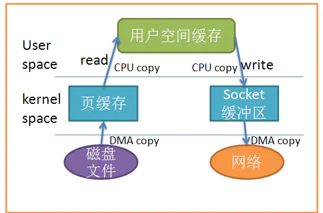
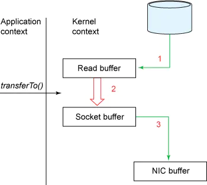

# I/O模型

1）BIO方式适用于连接数比较小且固定的架构，这种方式对服务器资源要求比较高，并发局限于应用中，JDK1.4之前的唯一选择，但程序简单易懂。

2）NIO适用于连接数目多且连接比较短（轻操作）的架构，比如聊天服务器，弹幕系统，服务器间通讯等。编程比较复杂，JDK1.4开始支持。

3）AIO方式适用于连接数目多且连接比较长（重操作）的架构，比如相册服务器，充分调用OS参与并发操作，编程比较复杂，JDK7开始支持。

# 多线程BIO示例

没连接一个客户端，服务端启动一个线程处理，在等待客户端连接处是阻塞的，即accept方法是阻塞的

```java
package com.jolan.bio;

import java.io.IOException;
import java.io.InputStream;
import java.net.ServerSocket;
import java.net.Socket;
import java.util.concurrent.ExecutorService;
import java.util.concurrent.Executors;

public class BIOServer {
    public static void main(String[] args) throws Exception{

        //1.创建一个线程池
        //2.如果有客户端连接，就创建一个线程，与之通讯
        ExecutorService threadPool = Executors.newCachedThreadPool();

        //创建一个serverSocket
        ServerSocket serverSocket = new ServerSocket(7000);

        System.out.println("服务器启动了");

        while(true){
            //监听客户端连接
            Socket socket = serverSocket.accept();
            System.out.println("连接到一个客户端");

            //创建一个线程池通讯
            threadPool.execute(new Runnable() {
                @Override
                public void run() {
                    handler(socket);
                }
            });

        }
    }

    public static void handler(Socket socket){
        System.out.println("当前线程id：" + Thread.currentThread().getName());
        InputStream inputStream = null;
        try{
            byte[] bytes = new byte[1024];
            //通过socket获取输入流
            inputStream = socket.getInputStream();

            //循环读取数据
            while (true){
                System.out.println("当前线程id：" + Thread.currentThread().getName());

                int read = inputStream.read(bytes);
                if(read != -1){
                    System.out.println(new String(bytes, 0, read));
                }else{
                    break;
                }
            }

        }catch (Exception e){
            e.printStackTrace();
        }finally {
            if(inputStream != null){
                try {
                    inputStream.close();
                    socket.close();
                } catch (IOException e) {
                    e.printStackTrace();
                }
            }
        }
    }
}

```

启动两个客户端测试，输出结果：

```javascript
服务器启动了
连接到一个客户端
当前线程id：pool-1-thread-1
当前线程id：pool-1-thread-1
hello100
当前线程id：pool-1-thread-1
连接到一个客户端
当前线程id：pool-1-thread-2
当前线程id：pool-1-thread-2
ok100
当前线程id：pool-1-thread-2

```

# Buffer

## Buffer重要属性

1）capacity：容量，即可以容纳的最大数据，在缓冲区创建时设定，并且不能修改

2）limit：表示缓冲区的当前终点，不能对缓冲区超过极限的位置进行读写操作，极限是可以修改的

3）position：位置，下一个要被读或写的元素的索引，每次读写缓冲区数据是都会发生变化为下次读写做准备

4）mark：标记

## IntBuffer

IntBuffer是Buffer的一个子类

```java
package com.jolan.nio;

import java.nio.IntBuffer;

public class BasicBuffer {
    public static void main(String[] args) {

        //举例，IntBuffer，8种基本类型，除boolean都有
        IntBuffer intBuffer = IntBuffer.allocate(5);
        for(int i = 0 ; i < intBuffer.capacity() ; i++){
            intBuffer.put(i * 2);
        }
        /**
         * flip操作：将buffer转换，读写切换
         * limit = position;
         * position = 0;
         * mark = -1;
         */
        intBuffer.flip();
        while (intBuffer.hasRemaining()){
            System.out.println(intBuffer.get());
        }
    }
}
```

输出：

```html
0
2
4
6
8
```

## Buffer常用方法

1）buffer.position(int position)：设置从哪个位置开始操作

2）buffer.limit(int limit)：设置极限位置（此处不包含）

3）buffer.isReadOnly()：是否只读

4）buffer.clear()：擦除buffer

5）buffer.flip()：反转

6）buffer.hasRemaning()：是否还有

## ByteBuffer常用方法

1）ByteBuffer allocate(int capacity)：创建指定容量的缓冲区

2）byte get()：从当前position获取，获取后自动加一

3）ByteBuffer put(byte b)：从当前位置写入，写入后position自动加一

4）ByteBuffer put(int index, byte b)：从指定位置写入

# NIO三大核心组件的关系

1）每个channel都会对应一个Buffer

2）Selector对应一个线程，一个线程对应多个channel（连接）

3）程序切换到哪个channel是由事件决定的，即Event

4）Selector会根据不同的事件，在不同的channel上切换

5）Buffer就是一个内存换，底层使用数组的数据结构

6）数组的读取写入是通过Buffer，而BIO中要么是输入流，要么是输出流，不能双向。而Buffer读写是通过Buffer，需要用flip方法进行切换

7）channel是双向的，可以返回底层操作系统的情况，如Linux操作系统就是通道就是双向的

# Channel

1）BIO中流是单向的，例如FileInputStream对象只能进行读写数据的操作，而NIO是双向的

2）Channel在NIO中是一个接口

3）常用的Channel类有：FileChannel，DatagramChannel，ServerSocketChannel和SocketChannel

4）FileChannel用于文件的数据读写，DatagramChannel用于UDP的数据读写，ServerSocketChannel和SocketChannel用于TCP的数据读写

## FileChannel

FileChannel主要用来对文件进行IO操作

### FileChannel常用方法

1）public int read(ByteBuffer dst)：从通道读取数据到缓冲区

2）public int write(ByteBuffer src)：把缓冲区数据写到通道

3）public long transferFrom(ReadableByteChannel src, long position, long count)：从目标通道复制数据到当前通道

4）public long transferTo(long position, long count, WritableByteChannel target)：把数据从当前通道复制给目标通道

### FileChannel示例1

```java
package com.jolan.nio;

import java.io.FileOutputStream;
import java.nio.ByteBuffer;
import java.nio.channels.FileChannel;

public class NIOFileChannel01 {
    public static void main(String[] args) throws Exception{

        String str = "hello FileChannel01";

        FileOutputStream fileOutputStream = new FileOutputStream("file01.txt");

        //从输出流获取channel
        FileChannel fileChannel = fileOutputStream.getChannel();

        //创建ByteBuffer缓冲区
        ByteBuffer byteBuffer = ByteBuffer.allocate(1024);

        //将数据放入buffer
        byteBuffer.put(str.getBytes());

        //buffer反转
        byteBuffer.flip();

        //将byteBuffer数据写入到channel
        fileChannel.write(byteBuffer);

        //关闭流
        fileOutputStream.close();

    }
}
```

运行结果

- 

FileChannel实例2

```java
package com.jolan.nio;

import java.io.FileInputStream;
import java.io.FileOutputStream;
import java.nio.ByteBuffer;
import java.nio.channels.FileChannel;

public class NIOFileChannel02 {
    public static void main(String[] args) throws Exception{

        //创建输输入流
        FileInputStream fileInputStream = new FileInputStream("file01.txt");

        //获取channel
        FileChannel fileChannel = fileInputStream.getChannel();

        //创建ByteBuffer
        ByteBuffer byteBuffer = ByteBuffer.allocate(1024);

        //读取数据到Buffer
        fileChannel.read(byteBuffer);

        //输出文件中的内容
        System.out.println(new String(byteBuffer.array()));

        //关闭流
        fileInputStream.close();
    }
}

```

输出结果：hello FileChannel01  

### FileChannel示例2

```java
package com.jolan.nio;

import java.io.FileInputStream;
import java.io.FileOutputStream;
import java.nio.ByteBuffer;
import java.nio.channels.FileChannel;

public class NIOFileChannel02 {
    public static void main(String[] args) throws Exception{

        //创建输输入流
        FileInputStream fileInputStream = new FileInputStream("file01.txt");

        //获取channel
        FileChannel fileChannel = fileInputStream.getChannel();

        //创建ByteBuffer
        ByteBuffer byteBuffer = ByteBuffer.allocate(1024);

        //读取数据到Buffer
        fileChannel.read(byteBuffer);

        //输出文件中的内容
        System.out.println(new String(byteBuffer.array()));

        //关闭流
        fileInputStream.close();
    }
}

```

运行结果：hello FileChannel01                                                                                                                                                                                                                                                                                                                                                                                                                                                                                                                                                                                                                                                                                                                                                                                                                                                                                                                                                                                                                                             

### FileChannel示例3

工程根目录下新建文件file0301.txt，从该文件读取，写入到文件file0302.txt下

```java
package com.jolan.nio;

import java.io.FileInputStream;
import java.io.FileOutputStream;
import java.nio.ByteBuffer;
import java.nio.channels.FileChannel;

public class NIOFileChannel3 {
    public static void main(String[] args) throws Exception{
        //定义输入输出流
        FileInputStream fileInputStream = new FileInputStream("file0301.txt");
        FileOutputStream fileOutputStream = new FileOutputStream("file0302.txt");

        //获取channel
        FileChannel inputStreamChannel = fileInputStream.getChannel();
        FileChannel fileOutputStreamChannel = fileOutputStream.getChannel();

        //定义Buffer
        ByteBuffer byteBuffer = ByteBuffer.allocate(512);

        while (true){
            //清空buffer，将buffer的关键的属性重置
            byteBuffer.clear();
            int read = inputStreamChannel.read(byteBuffer);
            if(read == -1){
                break;
            }
            //buffer反转
            byteBuffer.flip();
            fileOutputStreamChannel.write(byteBuffer);
        }

        fileInputStream.close();
        fileOutputStream.close();

    }
}

```

运行结果：


### FileChannel示例4

使用transFrom完成图片的拷贝。工程根目录下的from.jpg拷贝到to.jpg

```java
package com.jolan.nio;

import java.io.FileInputStream;
import java.io.FileOutputStream;
import java.nio.channels.FileChannel;

public class FileChannel04 {
    public static void main(String[] args) throws Exception{
        //创建相关流
        FileInputStream fileInputStream = new FileInputStream("from.jpg");
        FileOutputStream fileOutputStream = new FileOutputStream("to.jpg");

        //获取各个流对应的channel
        FileChannel sourceChannel = fileInputStream.getChannel();
        FileChannel destChannel = fileOutputStream.getChannel();

        //使用transFrom完成copy
        destChannel.transferFrom(sourceChannel, 0, sourceChannel.size());

        //关闭通道和流
        sourceChannel.close();
        destChannel.close();

        fileInputStream.close();
        fileOutputStream.close();

        
    }
}

```

运行结果：


# Buffer和Channel的一些注意事项

1）ByteBuffer支持类型化的get和put，get的类型应该和put的类型一致，否则可能出现BufferUnderflowException异常

```java
package com.jolan.nio;

import java.nio.ByteBuffer;

public class ByteBufferGetAndPut {
    public static void main(String[] args) {
        ByteBuffer byteBuffer = ByteBuffer.allocate(1024);

        byteBuffer.putInt(100);
        byteBuffer.putLong(9);
        byteBuffer.putChar('龙');
        byteBuffer.putShort((short) 4);

        byteBuffer.flip();

        System.out.println(byteBuffer.getInt());
        System.out.println(byteBuffer.getLong());
        System.out.println(byteBuffer.getChar());
        System.out.println(byteBuffer.getShort());
    }
}
```

2）可以将一个Buffer转成只读Buffer

```java

package com.jolan.nio;

import java.nio.ByteBuffer;

public class ReadOnlyBuffer {
    public static void main(String[] args) {
        ByteBuffer byteBuffer = ByteBuffer.allocate(64);

        for (int i = 0 ; i < 64 ; i++){
            byteBuffer.put((byte)i);
        }

        byteBuffer.flip();

        ByteBuffer readOnlyBuffer = byteBuffer.asReadOnlyBuffer();

        System.out.println(readOnlyBuffer.getClass());

        //读取
        while (readOnlyBuffer.hasRemaining()){
            System.out.println(readOnlyBuffer.get());
        }

        //抛出ReadOnlyBufferException异常
        readOnlyBuffer.put((byte)100);
    }
}

```

3）NIO还提供了MappedByteBuffer，可以让文件在内存中（堆外内存）修改

```java
package com.jolan.nio;

import java.io.File;
import java.io.RandomAccessFile;
import java.nio.channels.FileChannel;

/**
 * MappedByteBuffer可以让文件直接在内存中修改，操作系统不需要再拷贝一次
 *
 */
public class MappedByteBuffer {
    public static void main(String[] args) throws Exception{
        RandomAccessFile randomAccessFile = new RandomAccessFile("raf.txt", "rw");
        FileChannel fileChannel = randomAccessFile.getChannel();

        /**
         * 参数1：读写模式
         * 参数2：可以修改的起始位置
         * 参数3：映射到内存的大小，即可以将文件的多少个字节映射到内存，也就是可以直接修改的范围
         */
        java.nio.MappedByteBuffer map = fileChannel.map(FileChannel.MapMode.READ_WRITE, 0, 5);

        //第0个位置修改成H，第3个位置修改成9
        map.put(0, (byte)'H');
        map.put(3, (byte)'9');

        randomAccessFile.close();

        System.out.println("修改成功");
    }
}
```

运行结果：H絾9娇榫欏煄椋炲皢鍦紝涓嶆暀鑳￠┈搴﹂槾灞?

4）支持多个Buffer，即Buffer数组完成读写

```java
package com.jolan.nio;
import sun.misc.BASE64Encoder;

import java.net.Inet4Address;
import java.net.InetAddress;
import java.net.InetSocketAddress;
import java.nio.Buffer;
import java.nio.ByteBuffer;
import java.nio.channels.ServerSocketChannel;
import java.nio.channels.SocketChannel;
import java.util.Arrays;

/**
 * Scattering:将数组写入到buffer时，可以采用Buffer数组，依次写入
 * Gatterging:从Buffer读取数据是，可以采用Buffer数组，依次读取
 */
public class ScatteringAndGatteringBuffer {
    public static void main(String[] args) throws Exception{
        //使用ServerSocketChannel和SocketChannel
        ServerSocketChannel serverSocketChannel = ServerSocketChannel.open();

        InetSocketAddress inetSocketAddress = new InetSocketAddress(7000);

        //绑定socket端口并启动
        serverSocketChannel.socket().bind(inetSocketAddress);

        //创建Buffer数组
        ByteBuffer[] byteBuffers = new ByteBuffer[2];

        byteBuffers[0] = ByteBuffer.allocate(5);
        byteBuffers[1] = ByteBuffer.allocate(3);

        //等待客户端连接
        SocketChannel socketChannel = serverSocketChannel.accept();

        //假定从客户端最多读取8个字节
        int messageLength = 8;
        //循环的读取
        while(true){
            int byteRead = 0;
            while(byteRead < messageLength){
                long read = socketChannel.read(byteBuffers);
                byteRead += read;//累计读取的字节数
                System.out.println("byteRead = " + byteRead);
                //使用流打印，查看当前bufer的position和limit
                Arrays.asList(byteBuffers).stream().map(buffer -> "position=" + buffer.position()
                    + ", limit = " + buffer.limit()).forEach(System.out::println);

                //这里怎么把ByteBuffer数组转成String？

                //将所有buffer反转
                Arrays.asList(byteBuffers).forEach(buffer -> buffer.flip());

                //将数据反显到客户端
                long bytewrite = 0;
                while(bytewrite < byteRead){
                    long write = socketChannel.write(byteBuffers);
                    bytewrite += write;
                }


                //将所有buffer复位
                Arrays.asList(byteBuffers).forEach(buffer -> buffer.clear());

                System.out.println("byteRead = " + byteRead + ", bytewrite = " + bytewrite + ", messageLength = " + messageLength);
            }
        }
    }
}
```

使用telnet，客户端输入helloa，输出结果：


```html
byteRead = 6
position=5, limit = 5
position=1, limit = 3
byteRead = 6, bytewrite = 6, messageLength = 8
```

# Selector

1）Java的NIO，用非阻塞的IO方式。可以用一个线程，处理多个客户端连接，就会用到Selector（选择器）

2）Selector能够检测多个注册的通道上是否有事件发生（注意：多个Channel以事件的方式可以注册到同一个Selector），如果有事件发生，遍获取事件然后针对每个事件进行相应的处理。这样就可以只用一个单线程去管理多个通道，也就是管理多个连接和请求

3）只有在连接/通道真正有读写事件发生时，才会进行读写，就大大减小了系统的开销，并且不必为每个连接都创建一个线程，不用去维护多个线程

4）避免了多线程之前上下文切换导致的开销

5）Netty的IO线程NioEventLoop聚合了Selector（选择器，页脚多路复用器），可以同时并发处理成百上千个客户端连接

6）当线程从某客户端Socket通道进行读写数据时，若没有数据可用时，该线程可以进行其他任务

7）线程通常将非阻塞IO的空闲时间用于在其他通道上执行IO操作，所以单独的线程可以管理多个输入和输出通道

8）由于读写操作都是非阻塞的，这就可以充分提升IO线程的运行效率，避免由于频繁的IO阻塞导致的线程挂起

9）一个IO线程可以并发处理N个客户端连接和读写操作，这从根本上解决了传统同步阻塞IO一连接一线程模型，架构的性能、弹性伸缩能力和可靠性都得到了极大的提升

## 原理分析


1）当客户端连接时，会通过ServerSocketChannel得到SocketChannel

2）将SocketChannel注册到Selector上，register(Selector sel, int ops)，一个Selector可以注册多个SocketChannel

3）注册后返回一个SelectionKey，会和该Selector关联（Selector中的Set集合）

4）Selector进行监听，通过select方法，返回有事件发生的通道的个数

5）进一步得到各个SelectionKey

6）在通过SelectionKey反向获取SocketChannel（通过channel(）方法）

7）通过得到的Channel，完成业务处理

## 简单示例

服务端：

```java
package com.jolan.nio;

import java.net.InetSocketAddress;
import java.nio.ByteBuffer;
import java.nio.channels.*;
import java.util.Iterator;
import java.util.Set;

public class NIOServer {
    public static void main(String[] args) throws Exception{

        //创建一个ServerSocketChannel
        ServerSocketChannel serverSocketChannel = ServerSocketChannel.open();
        //得到一个Selector对象
        Selector selector = Selector.open();
        //绑定7000端口
        serverSocketChannel.socket().bind(new InetSocketAddress(7000));
        //设置为非阻塞
        serverSocketChannel.configureBlocking(false);
        //把ServerSocketChannel注册到Selector，关心事件为OP_ACCEPT
        serverSocketChannel.register(selector, SelectionKey.OP_ACCEPT);
        //等待客户端连接
        while(true){
            //这里等待1S判断是否有事件
            if(selector.select(1000) == 0){
                System.out.println("服务器等待了1S，无关心事件");
                continue;
            }
            //如果返回大于0，获取SelectionKey集合
            Set<SelectionKey> selectionKeys = selector.selectedKeys();
            Iterator<SelectionKey> iterator = selectionKeys.iterator();
            while(iterator.hasNext()){
                SelectionKey selectionKey = iterator.next();
                //如果是OP_ACCEPT，表示有新的客户端连接
                if(selectionKey.isAcceptable()){
                    //给该客户端生成一个SocketChannel
                    SocketChannel socketChannel = serverSocketChannel.accept();
                    System.out.println("客户端连接成功，生成了一个SocketChannel:" + socketChannel.hashCode());
                    socketChannel.configureBlocking(false);
                    //将当前的SocketChannel注册到selector，关注事件是读取事件，同时给socketChannel关联一个Buffer
                    socketChannel.register(selector, SelectionKey.OP_READ, ByteBuffer.allocate(1024));
                }else if(selectionKey.isReadable()){
                    //通过key反向获取对应的Channel
                    SocketChannel socketChannel = (SocketChannel) selectionKey.channel();
                    //获取到该Channel关联的buffer
                    ByteBuffer buffer = (ByteBuffer)selectionKey.attachment();
                    socketChannel.read(buffer);
                    System.out.println("from客户端：" + new String(buffer.array()));
                }
            }
            //手动从集合中删除当前的SelectionKey，防止重复操作
            iterator.remove();
        }
    }
}
```

客户端：

```java
package com.jolan.nio;

import java.io.IOException;
import java.net.InetSocketAddress;
import java.nio.ByteBuffer;
import java.nio.channels.ServerSocketChannel;
import java.nio.channels.SocketChannel;

public class NIOClient {
    public static void main(String[] args) throws IOException {

        SocketChannel socketChannel = SocketChannel.open();
        //设置非阻塞模式
        socketChannel.configureBlocking(false);
        //设置远程ip和端口
        InetSocketAddress inetSocketAddress = new InetSocketAddress("127.0.0.1", 7000);

        if(!socketChannel.connect(inetSocketAddress)){
            while(!socketChannel.finishConnect()){
                System.out.println("因为连接需要时间，客户端不会阻塞，可以做其他工作...");
            }
        }
        //如果连接成功就发送数据
        String str = "Hello Jolan";
        //Wraps a byte array into a buffer.
        ByteBuffer byteBuffer = ByteBuffer.wrap(str.getBytes());
        //发送数据，将buffer中的数据写入到Channel
        socketChannel.write(byteBuffer);

        System.in.read();
    }
}
```

先启动服务端，再运行客户端，运行结果：

```html
服务器等待了1S，无关心事件
服务器等待了1S，无关心事件
服务器等待了1S，无关心事件
客户端连接成功，生成了一个SocketChannel:960604060
from客户端：Hello Jolan              
服务器等待了1S，无关心事件
服务器等待了1S，无关心事件
服务器等待了1S，无关心事件
服务器等待了1S，无关心事件
服务器等待了1S，无关心事件

Process finished with exit code -1
```

# SelectionKey Api

在服务端监听新的客户端Socket连接

1）public abstract Selector selector();//得到与之关联的selector对象

2）public abstract SelectableChannel channel();//得到与之关联的通道

3）public final Object attachment();//得到与之关联的共享数据

4）public abstract int interestOps(int ops);//设置或改变监听事件

5）public final boolean isAcceptable();//是否可以accept

6）public final boolean isReadable();//是否可以读

7）public final boolean isWritable();//是否可以写

# ServerSocketChannel Api

1）public static ServerSocketChannel open();//得到一个ServerSocketChannel 通道

2）public final ServerSocketChannel bind(SocketAddress var1);//设置服务器端口号

3）public final SelectableChannel configureBlocking(boolean block);//设置阻塞或非阻塞，false表示非阻塞

4）public abstract SocketChannel accept();//接收一个连接，返回代表这个连接的通道对象

5）public final SelectionKey register(Selector sel, int ops);//注册一个选择器并设置监听事件

# SocketChannel Api

网络IO通道，具体负责进行读写操作，NIO把缓冲区的数据写入通道，或把通道的数据读到缓冲区

1）public static SocketChannel open();//得到一个SocketChannel 通道

2）public static SocketChannel open(SocketAddress var0);//得到一个SocketChannel 通道

3）public final SelectableChannel configureBlocking(boolean block);//设置阻塞或非阻塞，false表示非阻塞

4）public abstract boolean connect(SocketAddress var1);//连接服务器

5）public abstract boolean finishConnect();//如果上面的方法连接失败，接下来就要通过该方法完成连接操作

6）public abstract int read(ByteBuffer var1);//从通道读数据

7）public abstract int write(ByteBuffer var1);//向通道写数据

8）public final SelectionKey register(Selector sel, int ops, Object att);//注册一个选择器并设置监听事件，最后一个参数可以设置共享数据（Buffer）

9）public final void close();//关闭通道

# 使用NIO编写一个简易聊天系统

## 代码要求

服务端代码要求：

1.服务端启动并监听6667端口

2.服务端可以接受客户端信息，并实现转发、提示上线和离线

客户端代码要求：

1.连接服务器

2.发送消息

3.接受服务端消息

## 服务端代码

```java
package com.jolan.nio.groupchat;

import java.io.IOException;
import java.net.InetSocketAddress;
import java.net.Socket;
import java.nio.ByteBuffer;
import java.nio.channels.*;
import java.util.Iterator;
import java.util.Set;

public class GroupChatServer {
    //定义属性
    private Selector selector;
    private ServerSocketChannel listenChannel;
    private static final int PORT = 6667;

    public GroupChatServer() {
        try{
            //得到选择器
            selector = Selector.open();
            //获得ServerSocketChannel
            listenChannel = ServerSocketChannel.open();
            //绑定服务器端口
            listenChannel.socket().bind(new InetSocketAddress(PORT));
            //设置非阻塞模式
            listenChannel.configureBlocking(false);
            //将channel注册到Selector
            listenChannel.register(selector, SelectionKey.OP_ACCEPT);
        }catch(IOException e){
            e.printStackTrace();
        }
    }

    //监听
    public void listen(){
        try{
            //循环处理
             while(true){
                 int count = selector.select(2000);
                 if(count > 0){
                    //遍历得到的SelectionKey
                     Set<SelectionKey> selectionKeys = selector.selectedKeys();
                     Iterator<SelectionKey> iterator = selectionKeys.iterator();
                     while(iterator.hasNext()){
                         SelectionKey selectionKey = iterator.next();
                         if(selectionKey.isAcceptable()){
                             SocketChannel socketChannel = listenChannel.accept();
                             socketChannel.configureBlocking(false);
                             //将该Channel注册到Selector
                             socketChannel.register(selector, SelectionKey.OP_READ);
                             //提示已上线
                             System.out.println(socketChannel.getRemoteAddress() + "上线");
                         }
                         if(selectionKey.isReadable()){
                            //通道发生read，即通道可读
                            read(selectionKey);
                         }
                         //把当前的key删除，防止会重复处理
                         iterator.remove();
                     }

                 }else{
                     //System.out.println("等待...");
                 }
             }
        }catch(Exception e){
            e.printStackTrace();
        }finally{

        }
    }

    //读取客户端消息
    private void read(SelectionKey selectionKey){
        //定义SocketChannel
        SocketChannel channel = null;
        try{
            //得到Channel
            channel = (SocketChannel) selectionKey.channel();
            //创建Buffer
            ByteBuffer byteBuffer = ByteBuffer.allocate(1024);

            int count = channel.read(byteBuffer);
            if(count > 0){
                //把缓冲区的数据转成字符串
                String msg = new String(byteBuffer.array());
                System.out.println("from客户端：" + msg);
                //向其他的客户端转发消息
                sendInfoToOtherClients(msg, channel);
            }
        }catch(IOException e){
            try {
                System.out.println(channel.getRemoteAddress() + "离线了...");
                //取消注册
                selectionKey.cancel();
                //关闭通道
                channel.close();
            } catch (IOException ex) {
                ex.printStackTrace();
            }
            e.printStackTrace();
        }finally{

        }
    }

    //转发消息给其他的客户的函
    private void sendInfoToOtherClients(String msg, SocketChannel self) throws IOException{
        System.out.println("服务器转发消息中...");
        //遍历所有注册到Selector上的SocketChannel，并且排除自己
        System.out.println("注册到selector通道个数为：" + selector.selectedKeys().size());
        for(SelectionKey key : selector.keys()){
            //通过key取出socketChannel
            Channel targetChannel = key.channel();
            if(targetChannel instanceof SocketChannel && targetChannel != self){
                //转型
                SocketChannel dest = (SocketChannel)targetChannel;
                ByteBuffer buffer = ByteBuffer.wrap(msg.getBytes());
                //将buffer的数据写入通道
                dest.write(buffer);
            }
        }
    }

    public static void main(String[] args) {
        GroupChatServer chatServer = new GroupChatServer();
        chatServer.listen();
    }
}
```

## 客户端代码

```java
package com.jolan.nio.groupchat;


import java.io.IOException;
import java.net.InetSocketAddress;
import java.nio.ByteBuffer;
import java.nio.channels.SelectableChannel;
import java.nio.channels.SelectionKey;
import java.nio.channels.Selector;
import java.nio.channels.SocketChannel;
import java.util.Iterator;
import java.util.Scanner;

public class GroupChatClient {
    //定义相关的属性
    private final String HOST = "127.0.0.1";
    private final int PORT = 6667;
    private Selector selector;
    private SocketChannel socketChannel;
    private String username;

    public GroupChatClient() throws IOException {
        selector = Selector.open();
        //连接服务器
        socketChannel = SocketChannel.open(new InetSocketAddress(HOST, PORT));
        //设置非阻塞
        socketChannel.configureBlocking(false);
        //将channel注册到Selector
        socketChannel.register(selector, SelectionKey.OP_READ);
        //得到username
        username = socketChannel.getLocalAddress().toString().substring(1);
        System.out.println(username + " is ok...");
    }

    //向服务器发送消息
    public void sendInfo(String info){
        info = username + " says: " + info;
        try{
            socketChannel.write(ByteBuffer.wrap(info.getBytes()));
        }catch(IOException e){
            e.printStackTrace();
        }finally{

        }
    }

    //读取从服务器端回复的消息
    public void readInfo(){
        try{
            int readChannels = selector.select();
            if(readChannels > 0){
                //有可用的通道
                Iterator<SelectionKey> iterator = selector.selectedKeys().iterator();
                while(iterator.hasNext()){
                    SelectionKey selectionKey = iterator.next();
                    if(selectionKey.isReadable()){
                        //得到相关的通道
                        SocketChannel src = (SocketChannel)selectionKey.channel();
                        //得到一个Buffer
                        ByteBuffer byteBuffer = ByteBuffer.allocate(1024);
                        //读取
                        src.read(byteBuffer);
                        //把读到的缓冲区数据转成字符串
                        String msg = new String(byteBuffer.array());
                        System.out.println(msg.trim());
                        //删除当前的SelectionKey，防止重复操作
                        iterator.remove();
                    }
                }

            }
        }catch(Exception e){
            e.printStackTrace();
        }finally{

        }
    }

    public static void main(String[] args) throws Exception{
        GroupChatClient chatClient = new GroupChatClient();

        //启动一个线程，每隔3s读取一次服务端数据
        new Thread(() -> {
            while (true){
                chatClient.readInfo();
                try {
                    Thread.currentThread().sleep(3000);
                } catch (InterruptedException e) {
                    e.printStackTrace();
                }
            }
        }).start();
        //发送数据给服务端
        Scanner scanner = new Scanner(System.in);
        while (scanner.hasNext()){
            String nextLine = scanner.nextLine();
            chatClient.sendInfo(nextLine);
        }
    }
}
```

## 运行结果

服务端：

```html
/127.0.0.1:31852上线
/127.0.0.1:31861上线
/127.0.0.1:31873上线
from客户端：127.0.0.1:31852 says: I am 31852                                         
服务器转发消息中...
注册到selector通道个数为：1
from客户端：127.0.0.1:31861 says: I am 31861                                          
服务器转发消息中...
注册到selector通道个数为：1
from客户端：127.0.0.1:31873 says: I am 31873                                            
服务器转发消息中...
注册到selector通道个数为：1
```

客户端1：I am 31852是在控制台输入的

```html
127.0.0.1:31852 is ok...
I am 31852
127.0.0.1:31861 says: I am 31861
127.0.0.1:31873 says: I am 31873
```

客户端2：I am 31861是在控制台输入的

```html
127.0.0.1:31861 is ok...
127.0.0.1:31852 says: I am 31852
I am 31861
127.0.0.1:31873 says: I am 31873
```

客户端3：I am 31873是在控制台输入的

```htm
127.0.0.1:31873 is ok...
127.0.0.1:31852 says: I am 31852
127.0.0.1:31861 says: I am 31861
I am 31873
```

# NIO与零拷贝

1）零拷贝是网络编程的关键，很多性能优化都离不开

2）在Java程序中，常用的零拷贝有mmap（内存映射）和sendFile

3）传统IO进行一次文件的读写需要4次拷贝，4次上下文切换。四次拷贝分别是：两次DMA copy，两次CPU copy。DMA拷贝，全称Direct Memory access，即不接拷贝，不使用CPU。




4）mmap优化：mmap通过内存映射，将文件映射到内核缓冲区，同时，用户空间可以共享内核空间的数据。这样一来，在进行网络传输时，就可以减少内核空间到用户空间的拷贝次数。mmap将拷贝次数减少到3次，状态切换依然是4次。


4）sendFile优化：Linux2.1版本提供了sendFile函数，其基本原理如下：数据根本不经过用户态，直接从内核缓冲区进入Socket缓冲区，同时，由于和用户态完全无关，就减少了一次上下文切换。拷贝次数变为3次，上下文切换次数变为2次




# 零拷贝示例

## 传统IO示例

```java
package com.jolan.nio.zeroCopy;

import java.io.DataInputStream;
import java.net.ServerSocket;
import java.net.Socket;

public class OldIOServer {
    public static void main(String[] args) throws Exception{
        ServerSocket serverSocket = new ServerSocket(7001);
        while(true){
            Socket socket = serverSocket.accept();
            DataInputStream dataInputStream = new DataInputStream(socket.getInputStream());
            try{
                byte[] byteArray = new byte[4096];
                long total = 0;
                while(true){
                    int read = dataInputStream.read(byteArray, 0, byteArray.length);
                    if(read == -1){
                        break;
                    }
                    total += read;
                }
                System.out.println("服务端读取了" + total + "字节数据");
            }catch(Exception e){
                e.printStackTrace();
            }finally{

            }
        }
    }
}
```

```java
package com.jolan.nio.zeroCopy;

import java.io.DataInputStream;
import java.io.DataOutputStream;
import java.io.FileInputStream;
import java.net.ServerSocket;
import java.net.Socket;

public class OldIOClient {
    public static void main(String[] args) throws Exception{
        Socket socket = new Socket("127.0.0.1", 7001);
        String fileName = "learnsewithpython.rar";
        FileInputStream fileInputStream = new FileInputStream(fileName);
        DataOutputStream dataOutputStream = new DataOutputStream(socket.getOutputStream());

        byte[] bytes = new byte[4096];
        long readcount;
        int total = 0;

        long startTime = System.currentTimeMillis();

        while((readcount = fileInputStream.read(bytes)) > 0){
            total += readcount;
            dataOutputStream.write(bytes);
        }
        System.out.println("发送总字节数：" + total + ", 耗时：" + (System.currentTimeMillis() - startTime));

        dataOutputStream.close();
        socket.close();
        fileInputStream.close();
    }
}
```

运行结果：

客户端：

```html
发送总字节数：159211, 耗时：1
```

服务端：

```html
服务端读取了159744字节数据
```

文件属性：


## 零拷贝

```java
package com.jolan.nio.zeroCopy;

import java.net.InetSocketAddress;
import java.net.ServerSocket;
import java.nio.ByteBuffer;
import java.nio.channels.ServerSocketChannel;
import java.nio.channels.SocketChannel;

public class NewIOServer {
    public static void main(String[] args) throws Exception{
        InetSocketAddress inetSocketAddress = new InetSocketAddress(7002);
        ServerSocketChannel serverSocketChannel = ServerSocketChannel.open();
        ServerSocket serverSocket = serverSocketChannel.socket();
        serverSocket.bind(inetSocketAddress);
        ByteBuffer byteBuffer = ByteBuffer.allocate(4096);
        while(true){
            SocketChannel socketChannel = serverSocketChannel.accept();
            int readCount = 0;
            while(readCount != -1){
                try{
                    readCount = socketChannel.read(byteBuffer);
                }catch(Exception e){
                    e.printStackTrace();
                    break;
                }
                //position = 0, mark作废
                byteBuffer.rewind();
            }
        }

    }
}
```

```java
package com.jolan.nio.zeroCopy;

import java.io.FileInputStream;
import java.net.InetSocketAddress;
import java.nio.channels.FileChannel;
import java.nio.channels.SocketChannel;

public class NewIOClient {
    public static void main(String[] args) throws Exception{
        SocketChannel socketChannel = SocketChannel.open();
        socketChannel.connect(new InetSocketAddress("127.0.0.1", 7002));
        String fileName = "learnsewithpython.rar";

        //获取文件Channel
        FileChannel fileChannel = new FileInputStream(fileName).getChannel();

        long startTime = System.currentTimeMillis();

        //在Linux下一个transTo方法就可以完成传输
        //在windows下一次调用最多只能发送8M文件，如果大于8M就需要分段发送，需要注意传输位置
        long transferTo = fileChannel.transferTo(0, fileChannel.size(), socketChannel);
        System.out.println("发送的总的字节数是：" + transferTo + ", 总耗时时间为：" + (System.currentTimeMillis() - startTime));

        fileChannel.close();
    }
}
```

# 原生NIO存在的问题

1）NIO的类库和API复杂，使用麻烦：需要熟练掌握Selector、ServerSocketChannel、SocketChannel、ByteBuffer等

2）需要具备其他额外的技能：要熟悉Java多线程编程，因为NIO涉及到Reactor模式，你必须对多线程和网络编程非常熟悉，才能编写出高质量的NIO程序

3）开发工作量和难度非常大：例如客户端面临断连重连、网络闪断、半包读写、失败缓存、网络拥塞和异常流的处理等等

4）JDK NIO的bug：例如Epoll Bug，它会导致Selector空轮询，最终导致CPU使用率100%

# Netty官网说明

1）Netty是由JBoss提供的一个Java开源框架。Netty提供异步、基于事件驱动的网络应用程序框架，用以快速开发高性能、高可靠性的网络IO程序

2）Netty可以帮助快速、简单的开发一个网络应用，相当于简化和流程化了NIO的开发过程

3）Netty是目前最流行的NIO框架，Netty在互联网领域、大数据分布式计算领域、游戏行业、通信行业得到了广泛的应用，知名的Elasticsearch、Dubbo框架内部都采用了Netty

# Netty的优点

1）设计优雅：适用于各种传输类型的统一，API阻塞和非阻塞Socket，基于灵活和可扩展的事件模型，可以清晰的分离关注点，高度可定制的线程模型

2）使用方便：详细记录的Javadoc，用户指南和示例，没有其他依赖项，JDK5或者JDK6就足够了

3）高性能、吞吐量更高、延迟更低

4）安全：完整的SSL/TLS和startTLS的支持

5）社区活跃

# Netty版本说明

1）Netty版本分为Netty3.x、Netty4.X和Netty5.x

2）因为Netty5.x出现重大bug，已经被官网废弃，目前推荐的是Netty4.x的稳定版本

3）Netty下载地址：https://bintray.com/netty/downloads/netty/

# 传统阻塞IO服务模型

模型特点：

1）采用阻塞IO模式获取输入的数据

2）每个连接都需要独立的线程完成数据的输入、业务处理和数据返回

问题分析：

1）当并发数很大时，就会创建大量的线程，占用很多的系统资源

2）连接创建后，如果当前线程没有数据可读，该线程会阻塞在读取方法上，造成线程资源的浪费

# Reactor线程模型

针对传统阻塞模型的2个缺点，解决方案如下：

1）基于I/O复用模型：多个连接公用一个阻塞对象，应用程序只需要一个阻塞对象等待，无需阻塞等待所有连接。当某个连接有新数据可以处理时，操作系统通知应用程序，线程从阻塞状态返回，开始进行业务处理

2）基于线程池复用线程资源：不必再为每个连接创建线程，将连接完成后的业务处理任务分配给线程进行处理，一个线程可以处理多个连接的业务（线程池复用）

## 单Reactor单线程

服务端用一个线程通过多路复用搞定所有的IO操作（包括连接、读写等） 。适合处理客户端数量有限，业务处理非常快捷的场景

优缺点：

1）优点：模型简单，没有多线程、进程通信、竞争的问题，全部都在一个线程中完成

2）缺点1：性能问题，只有一个线程，无法完全发挥多核CPU的性能，Handler在处理某个连接的业务时，整个进程无法处理其他连接事件，很容器导致性能瓶颈

3）缺点2：可靠性问题，线程意外终止，或者进入死循环，会导致整个系统通信模块不可用，不能接收和处理外部消息，造成节点故障

## 单Reactor多线程

1）Reactor对象通过select监控客户端请求事件，收到事件后，通过dispatch进行分发

2）如果建立连接请求，则由Acceptor通过accept处理连接请求，然后创建一个Handler对象完成连接后的各种事件

3）如果不是连接请求，则有Reactor分发调用连接对应的Handler来处理

4）Handler只负责响应事件，不做具体的业务处理，通过read读取数据后，会分发给后面的worker线程池的某个线程处理业务

5）worker线程池会分配独立线程完成真正的业务，并将结果返回给Handler

6）Handler收到响应后，通过send将结果返回给client

方案优缺点：

1）优点：可以充分利用cpu的处理能力

2）缺点：多线程数据共享和访问比较复杂，Reactor处理所有的事件监听和响应，在单线程运行，在高并发场景容易出现性能瓶颈

## 主从Reactor多线程

1）Reactor主线程MainReactor对象通过select监听连接事件，收到事件后，通过Acceptor处理连接事件

2）当Acceptor处理连接事件后，MainReactor将连接分配给SubReactor

3）SubReactor将连接加入到连接队列进行监听，并创建Handler进行各种事件处理

4）当有新事件发生时，SubReactor就会调用对应的Handler处理

5）Handler通过read读取数据，分发给后面的worker线程处理

6）worker线程池分配独立的worker线程进行业务处理，并返回结果

7）Handler收到响应的结果后，再通过send将结果返回给client

8）Reactor主线程可以对应多个Reactor子线程

优缺点：

1）优点1：父线程与子线程的数据交互简单职责明确，父线程只需要接收新连接，子线程完成后续的业务操作

2）优点2：父线程与子线程的数据交互简单，Reactor主线程只需要把新连接传给子线程，子线程无需返回数据

3）缺点：变成复杂度高

# Netty线程模型

1. Netty抽象出两个线程池：BossGroup专门负责接收客户端的连接，WorkerGroup专门负责网络的读写

2. BossGroup和WorkGroup类型都是NioEventLoopGroup

3. NioEventLoopGroup相当于一个事件循环组，这个组中含有多个事件循环，每个事件循环是一个NioEventLoop

4. NioEventLoop表示一个不断循环的执行处理任务的线程，每个NioEventLoop都有一个selector，用于监听绑定在其上的socket网络通讯

5. NioEventLoopGroup可以有多个线程，即可以有多个NioEventLoop

6. 每个Boss NioEventLoop循环有3步

   1）轮询accept事件

   2）处理accept事件，与client建立连接，生成NioSocketChannel，并将其注册到某个Worker NIOEventLoop上的selector

   3）处理队列中的其他任务，即runAllTasks

7. 每个worker NioEventLoop循环有3步

   1）轮询read、write事件

   2）在对应的NioSocketChannel处理read、write事件

   3）处理队列中的其他任务，即runAllTasks

8. 每个Worker NioEventLoop处理业务时，会使用pipeline管道，pipeline中包含了channel，即通过pipeline可以获得对应的通道，管道中维护了很多的处理器

# Netty简单示例

服务端：

```java
package com.jolan.netty.simple;

import io.netty.bootstrap.ServerBootstrap;
import io.netty.channel.ChannelFuture;
import io.netty.channel.ChannelInitializer;
import io.netty.channel.ChannelOption;
import io.netty.channel.EventLoopGroup;
import io.netty.channel.nio.NioEventLoopGroup;
import io.netty.channel.socket.SocketChannel;
import io.netty.channel.socket.nio.NioServerSocketChannel;

public class NettyServer {
    public static void main(String[] args) throws InterruptedException {
        //创建BossGroup和WorkerGroup
        //BossGroup仅处理连接请求，WorkerGroup与客户端进行业务处理
        //两个都是无限循环
        //bossGroup和workerGroup含有的子线程（NioEventLoop）的个数默认是cpu的核数 * 2
        EventLoopGroup bossGroup = new NioEventLoopGroup();
        EventLoopGroup workerGroup = new NioEventLoopGroup();
        try{
            //创建服务器端的启动对象，配置启动参数
            ServerBootstrap serverBootstrap = new ServerBootstrap();
            //使用链式编程进行设置
            serverBootstrap.group(bossGroup, workerGroup)//设置两个线程组
                    .channel(NioServerSocketChannel.class)//使用NioServerSocketChannel作为服务器的通道实现
                    .option(ChannelOption.SO_BACKLOG, 128)//设置线程队列等待连接的个数
                    .childOption(ChannelOption.SO_KEEPALIVE, true)//只是保持连接活动状态
                    .childHandler(new ChannelInitializer<SocketChannel>() {
                        //给pipeline设置处理器
                        @Override
                        protected void initChannel(SocketChannel ch) throws Exception {
                            ch.pipeline().addLast(new NettyServerHandler());
                        }
                    })//给workerGroup的EventLoop对应的管道设置处理器
            ;
            System.out.println("服务器is ready");
            //绑定一个端口并且同步
            ChannelFuture channelFuture = serverBootstrap.bind(6668).sync();
            //对关闭通道进行监听
            channelFuture.channel().closeFuture().sync();
        }catch(Exception e){
            e.printStackTrace();
        }finally{
            bossGroup.shutdownGracefully();
            workerGroup.shutdownGracefully();
        }

    }
}
```

服务端Handler：

```java
package com.jolan.netty.simple;

import com.sun.scenario.effect.impl.sw.sse.SSEBlend_SRC_OUTPeer;
import io.netty.buffer.ByteBuf;
import io.netty.buffer.Unpooled;
import io.netty.channel.ChannelHandlerContext;
import io.netty.channel.ChannelInboundHandlerAdapter;
import io.netty.util.CharsetUtil;

/**
 * 自定义的Handler需要继承Netty规定好的HandlerAdapter
 * 这时定义的Handler才能被Netty识别
 */
public class NettyServerHandler extends ChannelInboundHandlerAdapter {
    /**
     *
     * @param ctx 上下文对象，含有管道pipeline，通道Channel，地址
     * @param msg 客户端发送的数据，默认是Object格式，需要进行转换
     * @throws Exception
     */
    @Override
    public void channelRead(ChannelHandlerContext ctx, Object msg) throws Exception {
        System.out.println("server ctx = " + ctx);
        //将msg转程ByteBuffer
        ByteBuf buf = (ByteBuf)msg;
        System.out.println("客户端发送消息是：" + buf.toString(CharsetUtil.UTF_8));
        System.out.println("客户端地址：" +   ctx.channel().remoteAddress());
    }

    /**
     * 数据读取完毕
     * @param ctx
     * @throws Exception
     */
    @Override
    public void channelReadComplete(ChannelHandlerContext ctx) throws Exception {
        //write+flush方法，将数据写入缓冲并刷新
        //一般需要对发送的数据进行编码
        ctx.writeAndFlush(Unpooled.copiedBuffer("hello，客户端~", CharsetUtil.UTF_8));
    }

    @Override
    public void exceptionCaught(ChannelHandlerContext ctx, Throwable cause) throws Exception {
        ctx.close();
    }
}
```

客户端：

```java
package com.jolan.netty.simple;

import io.netty.bootstrap.Bootstrap;
import io.netty.channel.ChannelFuture;
import io.netty.channel.ChannelInitializer;
import io.netty.channel.EventLoopGroup;
import io.netty.channel.nio.NioEventLoopGroup;
import io.netty.channel.socket.SocketChannel;
import io.netty.channel.socket.nio.NioSocketChannel;

public class NettyClient {
    public static void main(String[] args) throws InterruptedException {
        //客户端需要一个事件循环组
        EventLoopGroup eventExecutors = new NioEventLoopGroup();
        try{
            //客户端使用的不是ServerBootstrap，而是Bootstrap
            Bootstrap bootstrap = new Bootstrap();

            //设置相关参数
            bootstrap.group(eventExecutors)//设置线程组
                    .channel(NioSocketChannel.class)//设置客户端通道的实现类
                    .handler(new ChannelInitializer<SocketChannel>() {
                        @Override
                        protected void initChannel(SocketChannel ch) throws Exception {
                            ch.pipeline().addLast(new NettyClientHandler());//加入处理器
                        }
                    });
            System.out.println("客户端准备就绪");
            //启动客户端连接服务器端
            ChannelFuture future = bootstrap.connect("127.0.0.1", 6668).sync();
            //给关闭通道进行监听
            future.channel().closeFuture().sync();
        }catch(Exception e){
            e.printStackTrace();
        }finally{
            eventExecutors.shutdownGracefully();
        }


    }
}
```

客户端Handler：

```java
package com.jolan.netty.simple;

import io.netty.buffer.ByteBuf;
import io.netty.buffer.Unpooled;
import io.netty.channel.ChannelHandlerContext;
import io.netty.channel.ChannelInboundHandlerAdapter;
import io.netty.util.CharsetUtil;

public class NettyClientHandler extends ChannelInboundHandlerAdapter {
    /**
     * 当通道就绪时就会触发该方法
     * @param ctx
     * @throws Exception
     */
    @Override
    public void channelActive(ChannelHandlerContext ctx) throws Exception {
        System.out.println("client = " + ctx);
        ctx.writeAndFlush(Unpooled.copiedBuffer("hello，服务器~", CharsetUtil.UTF_8));
    }

    /**
     * 当通道有读取事件时触发
     * @param ctx
     * @param msg
     * @throws Exception
     */
    @Override
    public void channelRead(ChannelHandlerContext ctx, Object msg) throws Exception {
        ByteBuf byteBuf = (ByteBuf)msg;
        System.out.println("接收到服务器回复的消息：" + byteBuf.toString(CharsetUtil.UTF_8));
        System.out.println("服务器的地址：" + ctx.channel().remoteAddress());
    }

    @Override
    public void exceptionCaught(ChannelHandlerContext ctx, Throwable cause) throws Exception {
        cause.printStackTrace();
        ctx.close();
    }
}
```

服务端运行结果：

```html
服务器is ready
server ctx = ChannelHandlerContext(NettyServerHandler#0, [id: 0x1a7a277e, L:/127.0.0.1:6668 - R:/127.0.0.1:1792])
客户端发送消息是：hello，服务器~
客户端地址：/127.0.0.1:1792
```

客户端运行结果：

```html
客户端准备就绪
client = ChannelHandlerContext(NettyClientHandler#0, [id: 0xac07cc6d, L:/127.0.0.1:1792 - R:/127.0.0.1:6668])
接收到服务器回复的消息：hello，客户端~
服务器的地址：/127.0.0.1:6668
```

# 源码分析

针对上面“Netty简单示例”的代码进行断点分析

1.BossGroup和WorkerGroup默认的线程数是cpu核数乘以2。并且可以在构造函数中指定线程数，如指定BossGroup的线程数为1。

```java
EventLoopGroup bossGroup = new NioEventLoopGroup(1);
```


2.ctx、pipeline和channel关系

```java
    public void channelRead(ChannelHandlerContext ctx, Object msg) 
```

这段代码中，ctx中包含pipeline，pipleline中包含channel，而反过来channel也包含pipeline。inbound表示入站，outbound表示出站，pipeline底层数据结构是一个双向链表


# taskQueue

任务队列中的Task有三种类型

1）用户程序自定义的普通任务

2）用户自定义定时任务

3）非当前Reactor线程调用Channel的各种方法，如推送

## 抛出问题

对上面的NettyServerHandler做如下修改：

```java
@Override
public void channelRead(ChannelHandlerContext ctx, Object msg) throws Exception {
    Thread.sleep(10 * 1000);
    ctx.writeAndFlush(Unpooled.copiedBuffer("hello，客户端~服务端正在努力工作1", CharsetUtil.UTF_8));
    System.out.println("go on do something...");
}
```

那么客户端就会阻塞在读取的方法上，次数运行服务端和客户端会在客户端看到如下结果。第二行结果输出后会等待10S输出第三行结果

```html
客户端准备就绪
client = ChannelHandlerContext(NettyClientHandler#0, [id: 0xaa9b83b5, L:/127.0.0.1:2555 - R:/127.0.0.1:6668])
接收到服务器回复的消息：hello，客户端~服务端正在努力工作1hello，客户端~
服务器的地址：/127.0.0.1:6668
```

## 用户自定义任务解决

重新修改NettyServerHandler的channelRead方法

```java
@Override
public void channelRead(ChannelHandlerContext ctx, Object msg) throws Exception {
    ctx.channel().eventLoop().execute(new Runnable() {
        @Override
        public void run() {
            try{
                Thread.sleep(10 * 1000);
                ctx.writeAndFlush(Unpooled.copiedBuffer("hello，客户端~服务端正在努力工作2", CharsetUtil.UTF_8));
            }catch(Exception e){
                e.printStackTrace();
            }
            System.out.println("go on do something...");
        }
    });
}
```

再重新运行服务端和客户端。客户端最后两行的输出是在10S后打印的

```html
客户端准备就绪
client = ChannelHandlerContext(NettyClientHandler#0, [id: 0x19d5bdd3, L:/127.0.0.1:2760 - R:/127.0.0.1:6668])
接收到服务器回复的消息：hello，客户端~
服务器的地址：/127.0.0.1:6668
接收到服务器回复的消息：hello，客户端~服务端正在努力工作2
服务器的地址：/127.0.0.1:6668
```

队列中的任务是一个接着一个串行执行的，如果再加一个需要执行20S的任务，则总耗时是30S，队列中有两个任务，改造如下

```java
@Override
public void channelRead(ChannelHandlerContext ctx, Object msg) throws Exception {
    ctx.channel().eventLoop().execute(new Runnable() {
        @Override
        public void run() {
            try{
                Thread.sleep(10 * 1000);
                ctx.writeAndFlush(Unpooled.copiedBuffer("hello，客户端~服务端正在努力工作2", CharsetUtil.UTF_8));
            }catch(Exception e){
                e.printStackTrace();
            }
            System.out.println("go on do something...");
        }
    });
    
    ctx.channel().eventLoop().execute(new Runnable() {
        @Override
        public void run() {
            try{
                Thread.sleep(20 * 1000);
                ctx.writeAndFlush(Unpooled.copiedBuffer("hello，客户端~服务端正在努力工作3", CharsetUtil.UTF_8));
            }catch(Exception e){
                e.printStackTrace();
            }
            System.out.println("go on do something...");
        }
    });
}
```

在ctx->pipeline-channel->eventLoop->taskQueue中能发现队列大小为2


## 用户自定义定时任务解决

重新修改NettyServerHandler的channelRead方法

```java
@Override
public void channelRead(ChannelHandlerContext ctx, Object msg) throws Exception {
    ctx.channel().eventLoop().schedule(new Runnable() {
        @Override
        public void run() {
            try{
                Thread.sleep(10 * 1000);
                ctx.writeAndFlush(Unpooled.copiedBuffer("hello，客户端~服务端正在努力工作4", CharsetUtil.UTF_8));
            }catch(Exception e){
                e.printStackTrace();
            }
            System.out.println("go on do something...");
        }
    }, 5, TimeUnit.SECONDS);
}
```

在ctx->pipeline-channel-eventLoop下可以找到scheduledTaskQueue


# 异步模型介绍

1）异步的概念和同步相对。当一个异步过程调用发出后，调用者不能立刻得到结果，实际处理这个调用的组件在完成后，通过状态、通知和回调来通知调用者

2）Netty中的I/O操作是异步的，包括Bind、Write、Connect等操作会简单的返回一个ChannelFuture

3）调用者并不能立刻获得结果，而是通过Future-listener机制，用户可以方便的主动获取或者通过通知机制获得IO操作结果

4）Netty的异步模型是建立在future和callback之上的，callback就是回调。而Future的核心思想是：假设一个方法计算过程可能非常耗时，等待方法返回显然不合适，那么可以在调用方法的时候，立刻返回一个future，后续可以通过Future去监控方法的处理过程（即Future-listener机制）

## Future-listener举例

在“NettyServer服务端”增加以下代码

```java
//绑定一个端口并且同步
ChannelFuture channelFuture = serverBootstrap.bind(6668).sync();
//为ChannelFuture添加监听器（此处为新增代码）
channelFuture.addListener(new ChannelFutureListener() {
    @Override
    public void operationComplete(ChannelFuture future) throws Exception {
        if(future.isSuccess()){
            System.out.println("端口绑定成功");
        }else{
            System.out.println("端口绑定失败");
        }
    }
});
//对关闭通道进行监听
channelFuture.channel().closeFuture().sync();
```

服务端运行结果：

```html
服务器is ready
端口绑定成功
```

## Future和ChannelFuture

常用方法：

1）Channel channel();//返回正在进行的IO操作的通道

2）ChannelFuture sync();//等待异步操作执行完毕

# 使用netty创建一个HTTP服务

要求：监听8080端口，浏览器请求：http://localhost:8080，服务端返回消息：“Hello！我是服务器！”。并对特定请求进行过滤

HttpServer

```java
package com.jolan.netty.http;

import io.netty.bootstrap.ServerBootstrap;
import io.netty.channel.ChannelFuture;
import io.netty.channel.EventLoopGroup;
import io.netty.channel.nio.NioEventLoopGroup;
import io.netty.channel.socket.nio.NioServerSocketChannel;

public class HttpServer {
    public static void main(String[] args) {
        EventLoopGroup bossGroup = new NioEventLoopGroup(1);
        EventLoopGroup workerGroup = new NioEventLoopGroup();

        try{
            ServerBootstrap serverBootstrap = new ServerBootstrap();
            serverBootstrap.group(bossGroup, workerGroup).channel(NioServerSocketChannel.class)
                    .childHandler(new HttpServerInitializer());
            ChannelFuture channelFuture = serverBootstrap.bind(8080).sync();
            channelFuture.channel().closeFuture().sync();
        }catch(Exception e){
            e.printStackTrace();
        }finally{
            bossGroup.shutdownGracefully();
            workerGroup.shutdownGracefully();
        }
    }
}

```

HttpServerHandler

```java
package com.jolan.netty.http;

import io.netty.buffer.ByteBuf;
import io.netty.buffer.Unpooled;
import io.netty.channel.ChannelHandlerContext;
import io.netty.channel.SimpleChannelInboundHandler;
import io.netty.handler.codec.http.*;
import io.netty.util.CharsetUtil;

/**
 * SimpleChannelInboundHandler是ChannelInboundHandlerAdapter的子类
 * HttpObject表示客户端和服务器端相互通讯的数据被封装成HttpObject类型
 */
public class HttpServerHandler extends SimpleChannelInboundHandler<HttpObject> {
    /**
     * 读取客户端数据
     * @param ctx
     * @param msg
     * @throws Exception
     */
    @Override
    protected void channelRead0(ChannelHandlerContext ctx, HttpObject msg) throws Exception {
        //判断msg是否是Http
        if(msg instanceof HttpRequest){
            System.out.println("msg类型：" + msg.getClass());
            System.out.println("客户端地址：" + ctx.channel().remoteAddress());
            //回复信息给http客户端
            ByteBuf content = Unpooled.copiedBuffer("hello,我是服务器", CharsetUtil.UTF_8);
            //构造一个http响应
            DefaultFullHttpResponse response = new DefaultFullHttpResponse(HttpVersion.HTTP_1_1, HttpResponseStatus.OK, content);

            response.headers().set(HttpHeaderNames.CONTENT_TYPE, "text/plain;charset=UTF-8");
            response.headers().set(HttpHeaderNames.CONTENT_LENGTH, content.readableBytes());
            //将构件好的response返回
            ctx.writeAndFlush(response);

        }
    }
}

```

HttpServerInitializer

```java
package com.jolan.netty.http;

import io.netty.channel.Channel;
import io.netty.channel.ChannelInitializer;
import io.netty.channel.ChannelPipeline;
import io.netty.channel.socket.SocketChannel;
import io.netty.handler.codec.http.HttpServerCodec;

public class HttpServerInitializer extends ChannelInitializer<SocketChannel> {

    @Override
    protected void initChannel(SocketChannel ch) throws Exception {
        //向管道加入处理器
        //得到管道
        ChannelPipeline pipeline = ch.pipeline();
        //加入netty提供的httpServerCodec  codec => coder + decoder
        //HttpServerCodec是netty提供的http编码解码器
        pipeline.addLast("MyHttpServerCodec", new HttpServerCodec());
        //增加一个自定义的处理器
        pipeline.addLast("MyHttpServerHandler", new HttpServerHandler());


    }
}

```

启动服务器，浏览器访问http://localhost:8080，截图略

但是，此时发现服务端的输出，在客户端只请求一次的情况下，有两次输出：

```html
msg类型：class io.netty.handler.codec.http.DefaultHttpRequest
客户端地址：/0:0:0:0:0:0:0:1:18530
msg类型：class io.netty.handler.codec.http.DefaultHttpRequest
客户端地址：/0:0:0:0:0:0:0:1:18530
```

打开浏览器的调试模式，发现有两个请求到服务端，其中favicon.ico是获取图标文件


下面使用netty的http过滤资源功能

## Http资源过滤

修改HttpServerHandler，增加对资源过滤

```java
package com.jolan.netty.http;

import io.netty.buffer.ByteBuf;
import io.netty.buffer.Unpooled;
import io.netty.channel.ChannelHandlerContext;
import io.netty.channel.SimpleChannelInboundHandler;
import io.netty.handler.codec.http.*;
import io.netty.util.CharsetUtil;

import java.net.URI;

/**
 * SimpleChannelInboundHandler是ChannelInboundHandlerAdapter的子类
 * HttpObject表示客户端和服务器端相互通讯的数据被封装成HttpObject类型
 */
public class HttpServerHandler extends SimpleChannelInboundHandler<HttpObject> {
    /**
     * 读取客户端数据
     * @param ctx
     * @param msg
     * @throws Exception
     */
    @Override
    protected void channelRead0(ChannelHandlerContext ctx, HttpObject msg) throws Exception {
        //判断msg是否是Http
        if(msg instanceof HttpRequest){
            System.out.println("msg类型：" + msg.getClass());
            System.out.println("客户端地址：" + ctx.channel().remoteAddress());

            //获取到uri,过滤特定资源（本次新增代码）
            HttpRequest httpRequest = (HttpRequest) msg;
            URI uri = new URI(httpRequest.uri());
            if("/favicon.ico".equals(uri.getPath())){
                System.out.println("请求了/favicon.ico资源，服务器不做响应");
                return;
            }

            //回复信息给http客户端
            ByteBuf content = Unpooled.copiedBuffer("hello,我是服务器", CharsetUtil.UTF_8);
            //构造一个http响应
            DefaultFullHttpResponse response = new DefaultFullHttpResponse(HttpVersion.HTTP_1_1, HttpResponseStatus.OK, content);

            response.headers().set(HttpHeaderNames.CONTENT_TYPE, "text/plain;charset=UTF-8");
            response.headers().set(HttpHeaderNames.CONTENT_LENGTH, content.readableBytes());
            //将构建好的response返回
            ctx.writeAndFlush(response);

        }
    }
}
```

# Bootstrap和ServerBootstrap

1）Bootstrap意思是引导，一个Netty应用通常由一个Bootstrap开始，主要作用是配合整个Netty程序，串联各个组件，Netty中Bootstrap类是客户端程序的启动引导类，ServerBootstrap是服务端的启动引导类

2）常用方法：

- public ServerBootstrap group(EventLoopGroup parentGroup, EventLoopGroup childGroup);//该方法用于服务器端，用来这只两个EventLoop
- public B group(EventLoopGroup group);//该方法用于客户端，用来设置一个EventLoop
- public B channel(Class<? extends C> channelClass);//用来设置一个服务端的通道实现
- public <T> B option(ChannelOption<T> option, T value);//用来给ServerChannel添加配置
- public <T> ServerBootstrap childOption(ChannelOption<T> childOption, T value);//
- public ServerBootstrap childHandler(ChannelHandler childHandler);//用来设置业务处理类，即Handler，该Handler会在workerGroup生效执行
- public B handler(ChannelHandler handler);//用来设置业务处理类，即Handler，该Handler会在bossGroup生效执行
- public ChannelFuture bind(int inetPort);//用在服务器端设置占用的端口
- public ChannelFuture connect(String inetHost, int inetPort);//用在客户端连接服务器

# Channel

1）Netty网络通讯组件，能够用于执行网络I/O操作

2）通过Channel可获得当前网络连接的通道状态

3）通过Channel可获得网络连接的配置参数（例如接收缓冲区大小）

4）Channel提供异步的网络I/O操作（如建立连接，读写，绑定端口），异步调用意味着任何I/O调用都将立即返回，但是不保证在调用结束时所请求的I/O操作已完成

5）调用立即返回ChannelFuture实例，通过注册监听到ChannelFuture上，可以在I/O操作成功、失败或取消时回调通知调用方

6）支持关联的I/O操作与对应的处理程序

7）不同协议、不同的阻塞类型连接都有不同的Channel类型与之对应，常见的Channel类型有

- NioSocketChannel：异步的客户端TCP Socket连接
- NioServerSocketChannel：异步的服务端TCP Socket连接
- NioDatagramChannel：异步的UDP连接
- NioSctpChannel：异步的客户端Stcp连接
- NioServerSctpChannel：异步的客服务端Stcp连接

# Selector

1）Netty基于Selector对象实现I/O多路复用，通过Selector一个线程可以监听多个连接的Channel事件

2）当向一个Selector中注册Channel后，Selector内部的机制就可以自动不断地查询（select）这些注册的Channel是否有就绪的I/O事件（例如可读，可写，网络连接完成的），这样程序就可以简单的使用一个线程高效地管理多个Channel

# ChannelHandler

1）ChannelHandler是一个接口，处理I/O事件或拦截I/O操作，并将其转发到ChannelPipeline中的下一个处理程序

2）ChannelHandler本身并没有提供很多方法，因为这个接口的很多方法需要实现。为方便使用，通常自定义的Handler都是继承它的子类

- ChannelHandlerAdapter

- ChannelOutboundHandler

- ChannelInboundHandler

- ChannelInboundHandlerAdapter

- ChannelOutboundHandlerAdapter

- ChannelDuplexHandler

# Pipeline和ChannelPipeline

1）ChannelPipeline是Handler的集合，它负责处理和拦截inbound或者outbound的事件和操作，相当于一个贯穿Netty的链。

2）ChannelPipeline实现了一种高级形式的拦截过滤器模式，使用户可以完全控制事件的处理方式，以及Channel中各个ChannelHandler如何相互交互

3）在Netty中每个Channel都有且仅有一个ChannelPipeline与之对应。入站事件和出站事件在一个双向链表中，入站事件从链表head往后传递到最后一个入站的handler，出站事件会从链表tail往前传递到最前一个出站的handler，两种类型的handler互不干扰


如上面的HttpServer为例，将断点断在HttpServerInitializer的最下面，可以看到pipeline的组织方式是链表，每个节点的类型是DefaultChannelHandlerContext，该对象中又包含每个被逐一添加进去的Handler


4）常用方法：

- ChannelPipeline addFirst(String name, ChannelHandler handler);//把一个handler添加到链中的一个位置

- ChannelPipeline addLast(String name, ChannelHandler handler);//把一个handler添加到链中的最后一个位置

- ChannelPipeline remove(ChannelHandler handler);//删除一个handler

- ChannelPipeline addBefore(String baseName, String name, ChannelHandler handler);//添加到某个handler前面

- ChannelPipeline addAfter(String baseName, String name, ChannelHandler handler);//添加到某个handler的后面

# ChannelHandlerContext

1）保存Channel相关的所有上下文信息，同时关联一个ChannelHandler对象

2）即ChannelHandlerContext中包含一个具体的事件处理器ChannelHandler，同时ChannelHandlerContext中也绑定了对应的pipeline和channel的信息，方便对ChannelHandler进行调用

3）常用方法

- ChannelFuture close();//关闭通道
- ChannelOutboundInvoker flush();//刷新
- ChannelFuture writeAndFlush(Object msg);//将数据写到Channelpipeline中当前ChannelHandler的下一个ChannelHandler开始处理（出站）

# ChannelOption

1）Netty在创建Channel实例后，一般都需要设置ChannelOption参数

2）ChannelOption常见参数：

- ChannelOption.SO_BACKLOG
- ChannelOption.SO_KEEPALIVE

# EventLoopGroup和实现类NioEventLoopGroup

1）EventLoopGroup是一组EventLoop的抽象，Netty为了更好的利用cpu的多核资源，一般会有对个EventLoop同时工作，每个EventLoop维护着一个Selector实例

2）EventLoopGroup提供next接口，可以从组里面按照一定规则获取其中一个EventLoop来处理任务。在Netty服务端编程中，我们一般都需要提供两个EventLoopGroup，例如BossEventLoopGroup和WorkerEventLoopGroup

3）通常一个服务端口即一个ServerSocketChannel对应一个selector和一个EventLoop线程。BossEventLoop负责接收客户端的连接并将SocketChannel交给WorkerEventLoopGroup来进行I/O处理

4）WorkerEventLoopGroup会有next选择其中一个EventLoopGroup将这个SocketChannel注册到其维护的Selector并进行后续的I/O操作

5）常用方法

- new NioEventLoopGroup();//构造方法
- Future<?> shutdownGracefully();//断开连接，关闭线程

# Unpooled类

1）Netty提供了一个专门操作缓冲区（即Netty的数据容器）的工具类

2）常用方法：public static ByteBuf copiedBuffer(CharSequence string, Charset charset)

## 案例一

```java
package com.jolan.netty.buf;

import io.netty.buffer.ByteBuf;
import io.netty.buffer.Unpooled;

public class NettyBuf01 {
    public static void main(String[] args) {

        //Unpooled.buffer(10)创建了一个长度为10的字节数组byte[10]
        //在Netty的ByteBuf中，无需使用flip进行翻转，因为本身维护了readerindex和writerindex
        //0 - readerindex : 已经读取过的区域
        //readerindex - writerindex : 可以读取的区域
        //writerindex - capacity ： 可写的区域
        ByteBuf buffer = Unpooled.buffer(10);

        for(int i=0;i<10;i++){
            buffer.writeByte((byte)i);
        }
        System.out.println("capacity = " + buffer.capacity());
        for(int i=0;i<buffer.capacity();i++){
            buffer.readByte();
        }
    }
}
```

# 简易群聊系统Netty版

要求：服务端可以检测用户上线、离线，并实现消息转发。客户端通过channel可以无阻塞的发送消息给其他用户，同时也可以接收其他用户的消息

netty服务端

```java
package com.jolan.netty.groupchat;

import io.netty.bootstrap.ServerBootstrap;
import io.netty.channel.*;
import io.netty.channel.nio.NioEventLoopGroup;
import io.netty.channel.socket.SocketChannel;
import io.netty.channel.socket.nio.NioServerSocketChannel;
import io.netty.handler.codec.string.StringDecoder;
import io.netty.handler.codec.string.StringEncoder;

public class GroupChatServer {
    //监听端口
    private int port;

    public GroupChatServer(int port) {
        this.port = port;
    }

    //编写run方法处理客户端的请求
    public void run() throws InterruptedException {
        //创建两个线程组
        EventLoopGroup bossGroup = new NioEventLoopGroup(1);
        EventLoopGroup workerGroup = new NioEventLoopGroup(8);
        try{
            ServerBootstrap serverBootstrap = new ServerBootstrap();
            serverBootstrap.group(bossGroup, workerGroup)
                    .channel(NioServerSocketChannel.class)
                    .option(ChannelOption.SO_BACKLOG, 128)
                    .childOption(ChannelOption.SO_KEEPALIVE, true)
                    .childHandler(new ChannelInitializer<SocketChannel>() {
                        @Override
                        protected void initChannel(SocketChannel ch) throws Exception {
                            //获取pipeline
                            ChannelPipeline pipeline = ch.pipeline();
                            //增加解码器
                            pipeline.addLast("decoder", new StringDecoder());
                            //增加编码器
                            pipeline.addLast("encoder", new StringEncoder());
                            //增加业务处理
                            pipeline.addLast("myServerHandler", new GroupChatServerHandler());
                        }
                    });
            System.out.println("netty 服务启动");
            ChannelFuture channelFuture = serverBootstrap.bind(port).sync();
            channelFuture.channel().closeFuture().sync();
        }catch(Exception e){
            e.printStackTrace();
        }finally{
            bossGroup.shutdownGracefully();
            workerGroup.shutdownGracefully();
        }


    }

    public static void main(String[] args) throws Exception{
        new GroupChatServer(8081).run();
    }
}
```

服务端Handler

```java
package com.jolan.netty.groupchat;

import io.netty.channel.Channel;
import io.netty.channel.ChannelHandlerContext;
import io.netty.channel.SimpleChannelInboundHandler;
import io.netty.channel.group.ChannelGroup;
import io.netty.channel.group.DefaultChannelGroup;
import io.netty.util.concurrent.GlobalEventExecutor;

import java.text.SimpleDateFormat;
import java.util.Date;
import java.util.logging.SocketHandler;

public class GroupChatServerHandler extends SimpleChannelInboundHandler<String> {
    //定义一个Channel组，管理所有的Channel
    //GlobalEventExecutor.INSTANCE 是全局的事件执行器，是一个单例
    private static ChannelGroup channelGroup = new DefaultChannelGroup(GlobalEventExecutor.INSTANCE);

    SimpleDateFormat simpleDateFormat =  new SimpleDateFormat("yyyy-MM-dd HH:mm:ss");

    /**
     * handlerAdded 表示连接建立后，第一个被执行
     * 这里将当前的Channel加入到channelGroup
     * @param ctx
     * @throws Exception
     */
    @Override
    public void handlerAdded(ChannelHandlerContext ctx) throws Exception {
        Channel channel = ctx.channel();
        //将该客户加入聊天的信息推送给其他在线的客户端
        //该方法会将所有channgeGroup中的channel遍历并发送消息
        channelGroup.writeAndFlush("【客户端】" + channel.remoteAddress() + "加入聊天组" + simpleDateFormat.format(new Date()) + "\n");
        //将当前channel加入聊天组
        channelGroup.add(channel);
    }

    /**
     * 表示channel处于活动状态
     * @param ctx
     * @throws Exception
     */
    @Override
    public void channelActive(ChannelHandlerContext ctx) throws Exception {
        System.out.println(ctx.channel().remoteAddress() + "上线了"  + simpleDateFormat.format(new Date()) + "\n");
    }

    @Override
    public void channelInactive(ChannelHandlerContext ctx) throws Exception {
        System.out.println(ctx.channel().remoteAddress() + "离线了"  + simpleDateFormat.format(new Date()) + "\n");
    }

    /**
     * 断开连接出发
     * @param ctx
     * @throws Exception
     */
    @Override
    public void handlerRemoved(ChannelHandlerContext ctx) throws Exception {
        Channel channel = ctx.channel();
        channelGroup.writeAndFlush("【客户端】" + channel.remoteAddress() + "离开聊天组"  + simpleDateFormat.format(new Date()) + "\n");
        System.out.println("当前channelGroup大小：" + channelGroup.size());
    }

    @Override
    protected void channelRead0(ChannelHandlerContext ctx, String msg) throws Exception {
        //先获取当前channel并读取数据
        Channel channel = ctx.channel();
        //遍历channelGroup，根据不同情况回送不同的消息
        channelGroup.forEach(ch -> {
            if(ch != channel){
                //不是当前channel，直接转发
                ch.writeAndFlush("【客户端】" + channel.remoteAddress() + "发送消息" + msg + "\n");
            }else{
                ch.writeAndFlush("【自己】" + "发送了消息：" + msg + "\n");
            }
        });
    }

    @Override
    public void exceptionCaught(ChannelHandlerContext ctx, Throwable cause) throws Exception {
        ctx.close();
    }
}
```

客户端

```java
package com.jolan.netty.groupchat;

import io.netty.bootstrap.Bootstrap;
import io.netty.channel.*;
import io.netty.channel.nio.NioEventLoopGroup;
import io.netty.channel.socket.SocketChannel;
import io.netty.channel.socket.nio.NioSocketChannel;
import io.netty.handler.codec.string.StringDecoder;
import io.netty.handler.codec.string.StringEncoder;

import java.util.Scanner;

public class GroupChatClient {
    private final String host;
    private final int port;

    public GroupChatClient(String host, int port) {
        this.host = host;
        this.port = port;
    }

    public void run(){
        EventLoopGroup group = new NioEventLoopGroup();
        try{
            Bootstrap bootstrap = new Bootstrap();
            bootstrap.group(group)
                    .channel(NioSocketChannel.class)
                    .handler(new ChannelInitializer<SocketChannel>() {
                        @Override
                        protected void initChannel(SocketChannel ch) throws Exception {
                            ChannelPipeline pipeline = ch.pipeline();
                            //加入相关的handler
                            pipeline.addLast("decoder", new StringDecoder());
                            pipeline.addLast("encoder", new StringEncoder());
                            pipeline.addLast("myClientHander", new GroupChatClientHandler());
                        }
                    });
            ChannelFuture channelFuture = bootstrap.connect(host, port).sync();
            Channel channel = channelFuture.channel();
            System.out.println("----" + channel.localAddress() +"-----");
            //客户端输入信息
            Scanner scanner = new Scanner(System.in);
            while (scanner.hasNext()){
                String msg = scanner.nextLine();
                //通过channel发送到服务器端
                channel.writeAndFlush(msg + "\r\n");
            }
        }catch(Exception e){
            e.printStackTrace();
        }finally{
            group.shutdownGracefully();
        }
    }

    public static void main(String[] args) {
        new GroupChatClient("127.0.0.1", 8081).run();
    }
}
```

客户端Handler

```java
package com.jolan.netty.groupchat;

import io.netty.channel.ChannelHandlerContext;
import io.netty.channel.SimpleChannelInboundHandler;

public class GroupChatClientHandler extends SimpleChannelInboundHandler<String> {
    @Override
    protected void channelRead0(ChannelHandlerContext ctx, String msg) throws Exception {
        System.out.println(msg.trim());
    }
}
```

然后启动服务端，运行四个客户端。并且分别在1、2、4客户端输入我是第x个客户端。最后关闭第3个客户端。

服务端输出：

```html
netty 服务启动
/127.0.0.1:5541上线了2021-11-24 15:54:56

/127.0.0.1:5564上线了2021-11-24 15:55:01

/127.0.0.1:5589上线了2021-11-24 15:55:10

/127.0.0.1:5616上线了2021-11-24 15:55:18

/127.0.0.1:5589离线了2021-11-24 15:57:03

当前channelGroup大小：3
```

客户端1输出：

```html
----/127.0.0.1:5541-----
【客户端】/127.0.0.1:5564加入聊天组2021-11-24 15:55:01
【客户端】/127.0.0.1:5589加入聊天组2021-11-24 15:55:10
【客户端】/127.0.0.1:5616加入聊天组2021-11-24 15:55:18
我是第一个客户端
【自己】发送了消息：我是第一个客户端
【客户端】/127.0.0.1:5564发送消息我是第二个客户端
【客户端】/127.0.0.1:5589发送消息我是第三个客户端
【客户端】/127.0.0.1:5589离开聊天组2021-11-24 15:57:03
```

客户端2输出：

```html
----/127.0.0.1:5564-----
【客户端】/127.0.0.1:5589加入聊天组2021-11-24 15:55:10
【客户端】/127.0.0.1:5616加入聊天组2021-11-24 15:55:18
【客户端】/127.0.0.1:5541发送消息我是第一个客户端
我是第二个客户端
【自己】发送了消息：我是第二个客户端
【客户端】/127.0.0.1:5589发送消息我是第三个客户端
【客户端】/127.0.0.1:5589离开聊天组2021-11-24 15:57:03
```

客户端3输出：

```html
----/127.0.0.1:5589-----
【客户端】/127.0.0.1:5616加入聊天组2021-11-24 15:55:18
【客户端】/127.0.0.1:5541发送消息我是第一个客户端
【客户端】/127.0.0.1:5564发送消息我是第二个客户端
我是第三个客户端
【自己】发送了消息：我是第三个客户端
```

客户端4输出：

```html
----/127.0.0.1:5616-----
【客户端】/127.0.0.1:5541发送消息我是第一个客户端
【客户端】/127.0.0.1:5564发送消息我是第二个客户端
【客户端】/127.0.0.1:5589发送消息我是第三个客户端
【客户端】/127.0.0.1:5589离开聊天组2021-11-24 15:57:03
```

# Netty心跳检测案例

 要求：当服务器超过3s没有读时，提示读空闲；当服务器超过5s没有写时，提示写空闲；当服务器超过7s没有读写请求时，提示读写空闲。

服务端

```java
package com.jolan.netty.heartbeat;

import com.jolan.netty.simple.NettyServerHandler;
import io.netty.bootstrap.ServerBootstrap;
import io.netty.channel.*;
import io.netty.channel.nio.NioEventLoopGroup;
import io.netty.channel.socket.SocketChannel;
import io.netty.channel.socket.nio.NioServerSocketChannel;
import io.netty.handler.logging.LogLevel;
import io.netty.handler.logging.LoggingHandler;
import io.netty.handler.timeout.IdleStateHandler;

public class MyServer {
    public static void main(String[] args) {
        EventLoopGroup bossGroup = new NioEventLoopGroup();
        EventLoopGroup workerGroup = new NioEventLoopGroup();
        try{
            //创建服务器端的启动对象，配置启动参数
            ServerBootstrap serverBootstrap = new ServerBootstrap();
            //使用链式编程进行设置
            serverBootstrap.group(bossGroup, workerGroup)//设置两个线程组
                    .channel(NioServerSocketChannel.class)//使用NioServerSocketChannel作为服务器的通道实现
                    .handler(new LoggingHandler(LogLevel.INFO))//在bossGroup增加一个日志处理器
                    .childHandler(new ChannelInitializer<SocketChannel>() {
                        @Override
                        protected void initChannel(SocketChannel ch) throws Exception {
                            ChannelPipeline pipeline = ch.pipeline();
                            //加入一个netty提供的IdleStateHandler
                            /**
                             * 是netty提供的处理空闲状态的处理器
                             * int readerIdleTimeSeconds:多长时间没有读取，就会发送心跳检测包检测是否还是连接状态
                             * int writerIdleTimeSeconds:多长时间没有写操作，就会发送心跳检测包检测是否还是连接状态
                             * int allIdleTimeSeconds:多长时间没有读写操作，就会发送心跳检测包检测是否还是连接状态
                             * 当idleStateHandler触发后，就会传递给管道（pipeline）的下一个Handler去处理。通过调用下一个Handler的userEventTriggered，在该方法中去处理具体的事件
                             */
                            pipeline.addLast("idleStateHandler", new IdleStateHandler(3,5,7));
                            //加入对空闲检测进一步处理的Handler（自定义）
                            pipeline.addLast("myIdleStateHandler", new MyServerHandler());
                        }
                    })//给workerGroup的EventLoop对应的管道设置处理器
            ;
            //绑定一个端口并且同步
            ChannelFuture channelFuture = serverBootstrap.bind(8081).sync();
            //对关闭通道进行监听
            channelFuture.channel().closeFuture().sync();
        }catch(Exception e){
            e.printStackTrace();
        }finally{
            bossGroup.shutdownGracefully();
            workerGroup.shutdownGracefully();
        }
    }
}
```

服务端Handler

```java
package com.jolan.netty.heartbeat;

import io.netty.channel.ChannelHandlerContext;
import io.netty.channel.ChannelInboundHandlerAdapter;
import io.netty.handler.timeout.IdleStateEvent;

public class MyServerHandler extends ChannelInboundHandlerAdapter {
    /**
     *
     * @param ctx
     * @param evt
     * @throws Exception
     */
    @Override
    public void userEventTriggered(ChannelHandlerContext ctx, Object evt) throws Exception {
        if(evt instanceof IdleStateEvent){
            //将evt向下转型
            IdleStateEvent idleStateEvent = (IdleStateEvent)evt;
            String eventType = null;
            switch(idleStateEvent.state()){
                case READER_IDLE:
                    eventType = "读空闲";
                    break;
                case WRITER_IDLE:
                    eventType = "写空闲";
                    break;
                case ALL_IDLE:
                    eventType = "读写空闲";
                    break;
                default:
                    break;
            }
            System.out.println(ctx.channel().remoteAddress() + "超时事件发生" +eventType);
            System.out.println("服务器做相应处理");
        }
    }
}
```

运行结果：

```html
com.jolan.netty.heartbeat.MyServer
十一月 24, 2021 5:55:26 下午 io.netty.handler.logging.LoggingHandler channelRegistered
信息: [id: 0x33514193] REGISTERED
十一月 24, 2021 5:55:26 下午 io.netty.handler.logging.LoggingHandler bind
信息: [id: 0x33514193] BIND: 0.0.0.0/0.0.0.0:8081
十一月 24, 2021 5:55:26 下午 io.netty.handler.logging.LoggingHandler channelActive
信息: [id: 0x33514193, L:/0:0:0:0:0:0:0:0:8081] ACTIVE
十一月 24, 2021 5:55:43 下午 io.netty.handler.logging.LoggingHandler channelRead
信息: [id: 0x33514193, L:/0:0:0:0:0:0:0:0:8081] READ: [id: 0x9abc3fe8, L:/127.0.0.1:8081 - R:/127.0.0.1:8038]
十一月 24, 2021 5:55:43 下午 io.netty.handler.logging.LoggingHandler channelReadComplete
信息: [id: 0x33514193, L:/0:0:0:0:0:0:0:0:8081] READ COMPLETE
/127.0.0.1:8038超时事件发生读空闲
服务器做相应处理
/127.0.0.1:8038超时事件发生写空闲
服务器做相应处理
/127.0.0.1:8038超时事件发生读空闲
服务器做相应处理
/127.0.0.1:8038超时事件发生读写空闲
服务器做相应处理
/127.0.0.1:8038超时事件发生读空闲
服务器做相应处理
/127.0.0.1:8038超时事件发生写空闲
服务器做相应处理
```

# 使用netty创建WebSocket

服务端

```java
package com.jolan.netty.websocket;

import com.jolan.netty.heartbeat.MyServerHandler;
import io.netty.bootstrap.ServerBootstrap;
import io.netty.channel.ChannelFuture;
import io.netty.channel.ChannelInitializer;
import io.netty.channel.ChannelPipeline;
import io.netty.channel.EventLoopGroup;
import io.netty.channel.nio.NioEventLoopGroup;
import io.netty.channel.socket.SocketChannel;
import io.netty.channel.socket.nio.NioServerSocketChannel;
import io.netty.handler.codec.http.HttpObjectAggregator;
import io.netty.handler.codec.http.HttpServerCodec;
import io.netty.handler.codec.http.websocketx.WebSocketServerProtocolHandler;
import io.netty.handler.logging.LogLevel;
import io.netty.handler.logging.LoggingHandler;
import io.netty.handler.stream.ChunkedWriteHandler;
import io.netty.handler.timeout.IdleStateHandler;

public class MyWebSocketServer {
    public static void main(String[] args) {
        EventLoopGroup bossGroup = new NioEventLoopGroup();
        EventLoopGroup workerGroup = new NioEventLoopGroup();
        try{
            //创建服务器端的启动对象，配置启动参数
            ServerBootstrap serverBootstrap = new ServerBootstrap();
            //使用链式编程进行设置
            serverBootstrap.group(bossGroup, workerGroup)//设置两个线程组
                    .channel(NioServerSocketChannel.class)//使用NioServerSocketChannel作为服务器的通道实现
                    .handler(new LoggingHandler(LogLevel.INFO))//在bossGroup增加一个日志处理器
                    .childHandler(new ChannelInitializer<SocketChannel>() {
                        @Override
                        protected void initChannel(SocketChannel ch) throws Exception {
                            ChannelPipeline pipeline = ch.pipeline();
                            //因为基于http协议，所以需要使用http的编码和解码器
                            pipeline.addLast(new HttpServerCodec());
                            //是以块的方式写
                            pipeline.addLast(new ChunkedWriteHandler());
                            /**
                             *  因为http在传输过程中是分段的，HttpObjectAggregator可以将多个段聚合起来
                             *  这就是当浏览器发送大量数据是，就会发出多次http请求
                             */
                            pipeline.addLast(new HttpObjectAggregator(8192));
                            /**
                             * 对于webSocket，它的数据是以帧的形式传递的
                             * WebSocketFrame有6个子类
                             * 浏览器发送请求时，ws://localhost:8081/xxx，表示请求的uri
                             * WebSocketServerProtocolHandler核心功能是将http协议升级为ws协议，保持长连接
                             *
                             */
                            pipeline.addLast(new WebSocketServerProtocolHandler("/hello"));
                            //自定义，处理业务逻辑
                            pipeline.addLast(new MyTextWebSocketFrameHandler());
                        }
                    })
            ;
            //绑定一个端口并且同步
            ChannelFuture channelFuture = serverBootstrap.bind(8081).sync();
            //对关闭通道进行监听
            channelFuture.channel().closeFuture().sync();
        }catch(Exception e){
            e.printStackTrace();
        }finally{
            bossGroup.shutdownGracefully();
            workerGroup.shutdownGracefully();
        }
    }
}
```

服务端Handler

```java
package com.jolan.netty.websocket;

import io.netty.channel.ChannelHandlerContext;
import io.netty.channel.SimpleChannelInboundHandler;
import io.netty.handler.codec.http.websocketx.TextWebSocketFrame;

import java.time.LocalDateTime;

/**
 * TextWebSocketFrame表示一个文本帧
 */
public class MyTextWebSocketFrameHandler extends SimpleChannelInboundHandler<TextWebSocketFrame> {

    @Override
    protected void channelRead0(ChannelHandlerContext ctx, TextWebSocketFrame msg) throws Exception {
        System.out.println("服务器端收到消息：" + msg.text());
        //回复消息：当前时间 + 客户端消息
        ctx.channel().writeAndFlush(new TextWebSocketFrame("服务器时间" + LocalDateTime.now() + " " + msg.text()));
    }

    /**
     * 当web客户端连接后触发
     * @param ctx
     * @throws Exception
     */
    @Override
    public void handlerAdded(ChannelHandlerContext ctx) throws Exception {
        //id表示唯一的一个值，LongText是唯一的，ShortText不是唯一的
        System.out.println("handlerAdded被调用" + ctx.channel().id().asLongText());
        System.out.println("handlerAdded被调用" + ctx.channel().id().asShortText());
    }

    @Override
    public void handlerRemoved(ChannelHandlerContext ctx) throws Exception {
        System.out.println("handlerRemoved被调用" + ctx.channel().id().asLongText());
    }

    @Override
    public void exceptionCaught(ChannelHandlerContext ctx, Throwable cause) throws Exception {
        System.out.println("异常发生" + cause.getMessage());
        ctx.close();
    }
}
```

客户端

```html
<!DOCTYPE html>
<html lang="en">
<head>
    <meta charset="UTF-8">
    <title>Title</title>
</head>
<body>
    <form onsubmit="return false">
        <textarea id="message" style="height:300px;width:400px;"></textarea>
        <input type="button" value="发送消息" onclick="send(this.form.message.value)"></input>

        <textarea id = "responseText" style="height:300px;width:400px;"></textarea>
        <input type="button" value="清空内容" onclick="document.getElementById('responseText').value = ''"></input>
    </form>
</body>
<script>
    var socket;
    //判断当前浏览器是否支持webWocket
    if(window.WebSocket){
        socket = new WebSocket("ws://localhost:8081/hello");
        //相当于channelRead0，ev是收到服务器会送的消息
        socket.onmessage = function (ev) {
            var rt = document.getElementById("responseText");
            rt.value = rt.value + "\n" + ev.data;
        }
        //连接开启
        socket.onopen = function (ev) {
            var rt = document.getElementById("responseText");
            rt.value = "连接开启了...";
        }
        //连接关闭
         socket.onclose = function (ev) {
             var rt = document.getElementById("responseText");
             rt.value = rt.value + "\n" + "连接关闭了...";
         }
    }else{
        alert("当前浏览器不支持webSocket");
    }
    //发送消息到服务器
    function send(message) {
        if(!window.socket){
            return;
        }
        if(socket.readyState == WebSocket.OPEN){
            socket.send(message);
        }else{
            alert("连接没有开启");
        }
    }
</script>
</html>
```

客户端运行情况：


服务端输出：

```html
com.jolan.netty.websocket.MyWebSocketServer
十一月 24, 2021 7:36:13 下午 io.netty.handler.logging.LoggingHandler channelRegistered
信息: [id: 0xd0936405] REGISTERED
十一月 24, 2021 7:36:13 下午 io.netty.handler.logging.LoggingHandler bind
信息: [id: 0xd0936405] BIND: 0.0.0.0/0.0.0.0:8081
十一月 24, 2021 7:36:13 下午 io.netty.handler.logging.LoggingHandler channelActive
信息: [id: 0xd0936405, L:/0:0:0:0:0:0:0:0:8081] ACTIVE
十一月 24, 2021 7:36:24 下午 io.netty.handler.logging.LoggingHandler channelRead
信息: [id: 0xd0936405, L:/0:0:0:0:0:0:0:0:8081] READ: [id: 0x14d13199, L:/0:0:0:0:0:0:0:1:8081 - R:/0:0:0:0:0:0:0:1:10019]
十一月 24, 2021 7:36:24 下午 io.netty.handler.logging.LoggingHandler channelReadComplete
信息: [id: 0xd0936405, L:/0:0:0:0:0:0:0:0:8081] READ COMPLETE
handlerAdded被调用e470b8fffe7839ee-00002fe0-00000001-27fdb88e4b5f87f3-14d13199
handlerAdded被调用14d13199
服务器端收到消息：你好吗？
服务器端收到消息：不教胡马度阴山
handlerRemoved被调用e470b8fffe7839ee-00002fe0-00000001-27fdb88e4b5f87f3-14d13199

```

# 编码和解码

# 基本介概念

1）编写网络应用程序时，因为数据在网络中传输的都是二进制字节码数据，在发送数据时就需要编码，接收数据时就需要解码

2）codec（编解码器）的组成部分有两个：decoder（解码器）和encoder（编码器）。encoder负责把业务数据转换成字节码数据，decoder负责把数据转换成业务数据

3）Netty自带一些编解码器，如StringEncoder/StringDecoder，ObjectEncoder/ObjectDecoder。其中ObjectEncoder/ObjectDecoder是用java序列号实现的，但是java序列化不能跨平台，并且传输效率慢

## Protobuf

1）Protobuf是Google发布的开源项目，全程Google Protocol Buffers，是一种轻便高效的结构化数据存储格式，可以用于结构化数据串行化，或者说序列化。它很适合做数据存储或RPC数据交换格式

2）参考文档：https://developers.google.com/protocol-buffers/docs/proto

3）这里由于没有安装好protobuf插件，没有学习完成

# 入站出站机制

1）ChannelHandler充当了处理入站和出站数据的应用程序逻辑的容器，例如：实现ChannelInboundHandler接口（或ChannelInboundHandlerAdapter），就可以接收入站事件和数据，这些数据会被业务逻辑处理。当要给客户端发送响应时，也可以从ChannelInboundHandler冲刷（writeAndFlush）数据。业务逻辑通常写在一个或多个ChannelInboundHandler中。

2）当Netty发送或者接受一个消息时，就会将发送一次数据转换。入站消息会被解码，出站消息会被编码

3）Netty提供了一系列使用的编解码器，他们都实现了ChannelInboundHandler或ChannelOutboundHandler。在这些类中，channelRead已经被重写，在进行编解码后，会把结果发送给下一个Handler继续处理

# Netty的Handler调用机制

要求：使用自定义编解码器在服务端和客户端之间发送long型数据

服务端

```java
package com.jolan.inboundhandlerAndOutboundhandler;

import com.jolan.netty.simple.NettyServerHandler;
import io.netty.bootstrap.ServerBootstrap;
import io.netty.channel.*;
import io.netty.channel.nio.NioEventLoopGroup;
import io.netty.channel.socket.SocketChannel;
import io.netty.channel.socket.nio.NioServerSocketChannel;

public class MyServer {
    public static void main(String[] args) throws InterruptedException {
        EventLoopGroup bossGroup = new NioEventLoopGroup();
        EventLoopGroup workerGroup = new NioEventLoopGroup();
        try{
            ServerBootstrap serverBootstrap = new ServerBootstrap();

            serverBootstrap.group(bossGroup, workerGroup)
                    .channel(NioServerSocketChannel.class)
                    .childHandler(new MyServerInitializer());
            System.out.println("服务器is ready");
            ChannelFuture channelFuture = serverBootstrap.bind(6668).sync();
            channelFuture.channel().closeFuture().sync();
        }catch(Exception e){
            e.printStackTrace();
        }finally{
            bossGroup.shutdownGracefully();
            workerGroup.shutdownGracefully();
        }
    }
}
```

服务端初始化Handler

```java
package com.jolan.inboundhandlerAndOutboundhandler;

import io.netty.channel.ChannelInitializer;
import io.netty.channel.ChannelPipeline;
import io.netty.channel.socket.SocketChannel;

public class MyServerInitializer extends ChannelInitializer<SocketChannel> {
    @Override
    protected void initChannel(SocketChannel ch) throws Exception {
        ChannelPipeline pipeline = ch.pipeline();
        //增加入站Handler
        pipeline.addLast("byteToLongDecoder", new MyByteToLongDecoder());
        //增加编码器
        pipeline.addLast(new MyLongToByteEncoder());
        pipeline.addLast(new MyServerHandler());
    }
}
```

服务端业务处理Handler

```java
package com.jolan.inboundhandlerAndOutboundhandler;

import io.netty.channel.ChannelHandlerContext;
import io.netty.channel.SimpleChannelInboundHandler;

public class MyServerHandler extends SimpleChannelInboundHandler<Long> {
    @Override
    protected void channelRead0(ChannelHandlerContext ctx, Long msg) throws Exception {
        System.out.println("从客户端" + ctx.channel().remoteAddress() + "读取到：" + msg);
        //给客户端发送一个Long
        ctx.writeAndFlush(98765L);
    }

    @Override
    public void exceptionCaught(ChannelHandlerContext ctx, Throwable cause) throws Exception {
        ctx.close();
    }
}
```

客户端

```java
package com.jolan.inboundhandlerAndOutboundhandler;

import com.jolan.netty.simple.NettyClientHandler;
import io.netty.bootstrap.Bootstrap;
import io.netty.channel.ChannelFuture;
import io.netty.channel.ChannelInitializer;
import io.netty.channel.EventLoopGroup;
import io.netty.channel.nio.NioEventLoopGroup;
import io.netty.channel.socket.SocketChannel;
import io.netty.channel.socket.nio.NioSocketChannel;

public class MyClient {
    public static void main(String[] args) throws InterruptedException {
        EventLoopGroup eventExecutors = new NioEventLoopGroup();
        try{
            Bootstrap bootstrap = new Bootstrap();
            bootstrap.group(eventExecutors)//设置线程组
                    .channel(NioSocketChannel.class)//设置客户端通道的实现类
                    .handler(new MyClientInitializer());
            System.out.println("客户端准备就绪");
            ChannelFuture future = bootstrap.connect("127.0.0.1", 6668).sync();
            future.channel().closeFuture().sync();
        }catch(Exception e){
            e.printStackTrace();
        }finally{
            eventExecutors.shutdownGracefully();
        }
    }
}
```

客户端初始化

```java
package com.jolan.inboundhandlerAndOutboundhandler;

import io.netty.channel.ChannelInitializer;
import io.netty.channel.ChannelPipeline;
import io.netty.channel.socket.SocketChannel;

public class MyClientInitializer extends ChannelInitializer<SocketChannel> {

    @Override
    protected void initChannel(SocketChannel ch) throws Exception {
        ChannelPipeline pipeline = ch.pipeline();
        //加入一个出站的handler，对数据进行编码
        pipeline.addLast(new MyLongToByteEncoder());

        //加一个入站handler，对数据解码
        pipeline.addLast(new MyByteToLongDecoder());

        //加入自定义Handler处理业务逻辑
        pipeline.addLast(new MyClientHandler());
    }
}
```

客户端业务处理类

```java
package com.jolan.inboundhandlerAndOutboundhandler;

import io.netty.buffer.Unpooled;
import io.netty.channel.ChannelHandlerContext;
import io.netty.channel.SimpleChannelInboundHandler;
import io.netty.util.CharsetUtil;

public class MyClientHandler extends SimpleChannelInboundHandler<Long> {
    @Override
    protected void channelRead0(ChannelHandlerContext ctx, Long msg) throws Exception {
        System.out.println("服务器的ip=" + ctx.channel().remoteAddress());
        System.out.println("收到服务器的消息:" + msg);
    }

    @Override
    public void channelActive(ChannelHandlerContext ctx) throws Exception {
        System.out.println("MyClientHandler 发送数据");
        ctx.writeAndFlush(123456L);//发送一个Long

    }
}
```

编码器

```java
package com.jolan.inboundhandlerAndOutboundhandler;

import io.netty.buffer.ByteBuf;
import io.netty.channel.ChannelHandlerContext;
import io.netty.handler.codec.MessageToByteEncoder;

public class MyLongToByteEncoder extends MessageToByteEncoder<Long> {
    @Override
    protected void encode(ChannelHandlerContext ctx, Long msg, ByteBuf out) throws Exception {
        System.out.println("MyLongToByteEncoder#encode被调用");
        System.out.println("msg" + msg);
        out.writeLong(msg);
    }
}
```

解码器

```java
package com.jolan.inboundhandlerAndOutboundhandler;

import io.netty.buffer.ByteBuf;
import io.netty.channel.ChannelHandlerContext;
import io.netty.handler.codec.ByteToMessageDecoder;

import java.util.List;

public class MyByteToLongDecoder extends ByteToMessageDecoder {
    /**
     * decode会根据接收的数据，被多次调用，直到确定没有新的元素被添加到list，或者ByteBuf没有更多的可读字节为止
     * 如果List out不为空，就会把list的内容传递给下一个InboundHandler处理，该处理器的方法也会被调用多次
     *
     * @param ctx  上下文
     * @param in   入站的ByteBuf
     * @param out  List集合，将解码后的数据传给下一个InboundHandler
     * @throws Exception
     */
    @Override
    protected void decode(ChannelHandlerContext ctx, ByteBuf in, List<Object> out) throws Exception {
        System.out.println("MyByteToLongDecoder#decode被调用");
        //Long是八个字节，需要判断有8个字节才能读取
        if(in.readableBytes() >= 8){
            out.add(in.readLong());
        }
    }
}
```

运行结果：

服务端：

```html
服务器is ready
MyByteToLongDecoder#decode被调用
从客户端/127.0.0.1:36201读取到：123456
MyLongToByteEncoder#encode被调用
msg98765

```

客户端：

```html
客户端准备就绪
MyClientHandler 发送数据
MyLongToByteEncoder#encode被调用
msg123456
MyByteToLongDecoder#decode被调用
服务器的ip=/127.0.0.1:6668
收到服务器的消息:98765
```

改造客户端的业务处理类。注意注释部分的说明，如果发送的数据不是编解码Handler指定的类型，则不会走编解码Handler，而是直接将数据发送给下一个Handler处理

```java
package com.jolan.inboundhandlerAndOutboundhandler;

import io.netty.buffer.Unpooled;
import io.netty.channel.ChannelHandlerContext;
import io.netty.channel.SimpleChannelInboundHandler;
import io.netty.util.CharsetUtil;

public class MyClientHandler extends SimpleChannelInboundHandler<Long> {
    @Override
    protected void channelRead0(ChannelHandlerContext ctx, Long msg) throws Exception {
        System.out.println("服务器的ip=" + ctx.channel().remoteAddress());
        System.out.println("收到服务器的消息:" + msg);
    }

    @Override
    public void channelActive(ChannelHandlerContext ctx) throws Exception {
        System.out.println("MyClientHandler 发送数据");
        ctx.writeAndFlush(123456L);//发送一个Long

        //abcdabcdqwerqwer是16个字节
        //该处理器的前一个处理器是MyLongToByteEncoder
        //MyLongToByteEncoder父类是MessageToByteEncoder
        //MessageToByteEncoder会判断是否的write方法会判断需要出站的数据是不是Handler应该处理的类型，如果是则编码，否则跳过
        //因此在编写encoder时要注意传入的数据类型和要编码的处理类型要一致
        ctx.writeAndFlush(Unpooled.copiedBuffer("abcdabcdqwerqwer", CharsetUtil.UTF_8));
    }
}

```

# 编解码器

## ReplayingDecoder

public abstract class ReplayingDecoder<S> extends ByteToMessageDecoder

ReplayingDecoder扩展了ByteToMessageDecoder，使用这个类不必再调用readableBytes()方法判断数据是否够读取，参数S指定用户状态管理的类型，Void表示不需要状态管理。

```java
package com.jolan.inboundhandlerAndOutboundhandler;

import io.netty.buffer.ByteBuf;
import io.netty.channel.ChannelHandlerContext;
import io.netty.handler.codec.ByteToMessageDecoder;
import io.netty.handler.codec.ReplayingDecoder;

import java.util.List;

public class MyByteToLongDecoder2 extends ReplayingDecoder<Void> {

    @Override
    protected void decode(ChannelHandlerContext ctx, ByteBuf in, List<Object> out) throws Exception {
        //在ReplayingDecoder不需要判断数据是否足够读取，内部会进行判断
        out.add(in.readLong());
    }
}
```

## LineBasedFrameDecoder

使用行尾控制符\n或者\r\n作为分隔符来读取数据

## DelimiterBasedFrameDecoder

使用自定义的特殊字符作为消息的分隔符

## HttpObjectDecoder

http数据的解码器

## LengthFieldBasedFrameDecoder

通过指定长度来标识整包信息，这样就可以自动处理粘包和半包消息

# 对Log4j的支持

1）引入log4j的jar包

2）配置log4j.properites文件

3）启动即可

# TCP粘包和拆包

1）TCP是面相连接、面相流的，提供高可靠服务。收发两端都要有成对的socket，因此发送端为了将多个发送给接收端的包更有效的发送，使用了Nagle的优化算法，将多个间隔较小数据量较小的数据，合并成一个大的数据块，然后进行封包。这样做提高了效率，但是接收端就难以分辨出完整的数据包了，因为面相流的通信是无消息保护边界的

2）由于TCP无消息保护边界，需要在接收端处理消息边界问题，也就是我们说的粘包、拆包问题

## 粘包拆包问题示例

服务端

```java
package com.jolan.tcp;

import io.netty.bootstrap.ServerBootstrap;
import io.netty.channel.ChannelFuture;
import io.netty.channel.EventLoopGroup;
import io.netty.channel.nio.NioEventLoopGroup;
import io.netty.channel.socket.nio.NioServerSocketChannel;

public class MyServer {
    public static void main(String[] args) throws InterruptedException {
        EventLoopGroup bossGroup = new NioEventLoopGroup();
        EventLoopGroup workerGroup = new NioEventLoopGroup();
        try{
            ServerBootstrap serverBootstrap = new ServerBootstrap();

            serverBootstrap.group(bossGroup, workerGroup)
                    .channel(NioServerSocketChannel.class)
                    .childHandler(new MyServerInitializer());
            System.out.println("服务器is ready");
            ChannelFuture channelFuture = serverBootstrap.bind(6668).sync();
            channelFuture.channel().closeFuture().sync();
        }catch(Exception e){
            e.printStackTrace();
        }finally{
            bossGroup.shutdownGracefully();
            workerGroup.shutdownGracefully();
        }
    }
}

```

服务端初始化

```java
package com.jolan.tcp;

import com.jolan.inboundhandlerAndOutboundhandler.MyByteToLongDecoder;
import com.jolan.inboundhandlerAndOutboundhandler.MyLongToByteEncoder;
import io.netty.channel.ChannelInitializer;
import io.netty.channel.ChannelPipeline;
import io.netty.channel.socket.SocketChannel;

public class MyServerInitializer extends ChannelInitializer<SocketChannel> {
    @Override
    protected void initChannel(SocketChannel ch) throws Exception {
        ChannelPipeline pipeline = ch.pipeline();
        pipeline.addLast(new MyServerHandler());
    }
}

```

服务端handler

```java
package com.jolan.tcp;

import io.netty.buffer.ByteBuf;
import io.netty.buffer.Unpooled;
import io.netty.channel.ChannelHandlerContext;
import io.netty.channel.SimpleChannelInboundHandler;

import java.nio.charset.Charset;
import java.util.UUID;

public class MyServerHandler extends SimpleChannelInboundHandler<ByteBuf> {
    private int count;
    @Override
    protected void channelRead0(ChannelHandlerContext ctx, ByteBuf msg) throws Exception {
        byte[] buffer = new byte[msg.readableBytes()];
        msg.readBytes(buffer);

        //将buffer转换成字符串
        String s = new String(buffer, Charset.forName("utf-8"));
        System.out.println("服务端接收到消息：" + s);
        System.out.println("服务端接收到消息量 = " + (++this.count));

        //服务器回送消息给客户端，回送一个随机ID
        ByteBuf response = Unpooled.copiedBuffer(UUID.randomUUID().toString(), Charset.forName("utf-8"));
        ctx.writeAndFlush(response);
    }

    @Override
    public void exceptionCaught(ChannelHandlerContext ctx, Throwable cause) throws Exception {
        cause.getCause();
        ctx.close();
    }
}

```

客户端

```java
package com.jolan.tcp;

import io.netty.bootstrap.Bootstrap;
import io.netty.channel.ChannelFuture;
import io.netty.channel.EventLoopGroup;
import io.netty.channel.nio.NioEventLoopGroup;
import io.netty.channel.socket.nio.NioSocketChannel;

public class MyClient {
    public static void main(String[] args) throws InterruptedException {
        EventLoopGroup eventExecutors = new NioEventLoopGroup();
        try{
            Bootstrap bootstrap = new Bootstrap();
            bootstrap.group(eventExecutors)//设置线程组
                    .channel(NioSocketChannel.class)//设置客户端通道的实现类
                    .handler(new MyClientInitializer());
            System.out.println("客户端准备就绪");
            ChannelFuture future = bootstrap.connect("127.0.0.1", 6668).sync();
            future.channel().closeFuture().sync();
        }catch(Exception e){
            e.printStackTrace();
        }finally{
            eventExecutors.shutdownGracefully();
        }
    }
}

```

客户端初始化

```java
package com.jolan.tcp;

import com.jolan.inboundhandlerAndOutboundhandler.MyByteToLongDecoder;
import com.jolan.inboundhandlerAndOutboundhandler.MyLongToByteEncoder;
import io.netty.channel.ChannelInitializer;
import io.netty.channel.ChannelPipeline;
import io.netty.channel.socket.SocketChannel;

public class MyClientInitializer extends ChannelInitializer<SocketChannel> {

    @Override
    protected void initChannel(SocketChannel ch) throws Exception {
        ChannelPipeline pipeline = ch.pipeline();
        pipeline.addLast(new MyClientHandler());
    }
}

```

客户端handler

```java
package com.jolan.tcp;

import io.netty.buffer.ByteBuf;
import io.netty.buffer.Unpooled;
import io.netty.channel.ChannelHandlerContext;
import io.netty.channel.SimpleChannelInboundHandler;
import io.netty.util.CharsetUtil;

import java.nio.charset.Charset;

public class MyClientHandler extends SimpleChannelInboundHandler<ByteBuf> {

    private int count;
    @Override
    public void channelActive(ChannelHandlerContext ctx) throws Exception {
        //使用客户端发送十条数据
        for(int i = 0 ; i < 10 ; i++){
            ByteBuf byteBuf = Unpooled.copiedBuffer("hello server" + i, Charset.forName("utf-8"));
            ctx.writeAndFlush(byteBuf);
        }
    }

    @Override
    protected void channelRead0(ChannelHandlerContext ctx, ByteBuf msg) throws Exception {
        byte[] buffer = new byte[msg.readableBytes()];
        msg.readBytes(buffer);
        String message = new String(buffer, Charset.forName("utf-8"));
        System.out.println("客户端接收到消息：" + message);
        System.out.println("客户端接收消息数量：" + (++this.count));
    }

    @Override
    public void exceptionCaught(ChannelHandlerContext ctx, Throwable cause) throws Exception {
        cause.getCause();
        ctx.close();
    }
}

```

运行两次。可以发现服务端第一次接收到了客户端的全部消息，第二次分为4次接收，并且回复客户端4个随机数。并且每次重新运行客户端，服务端的接收次数可能都不一样。这就是粘包和拆包问题的展示。

服务端运行结果

```java
服务器is ready
服务端接收到消息：hello server0hello server1hello server2hello server3hello server4hello server5hello server6hello server7hello server8hello server9
服务端接收到消息量 = 1
服务端接收到消息：hello server0
服务端接收到消息量 = 1
服务端接收到消息：hello server1hello server2hello server3
服务端接收到消息量 = 2
服务端接收到消息：hello server4hello server5hello server6hello server7
服务端接收到消息量 = 3
服务端接收到消息：hello server8hello server9
服务端接收到消息量 = 4

```

客户端运行结果1

```html
客户端准备就绪
客户端接收到消息：47ddb4fb-484a-4d0b-954b-bba3d9d88f27
客户端接收消息数量：1
```

客户端运行结果2

```html
客户端准备就绪
客户端接收到消息：74c4f174-78dd-484f-a38b-a5c70d0c42eb5910e9e6-1450-42a0-876d-f47f0dcd1e5640729c24-2d1b-401d-8fef-0134adb68d465d16d7eb-af72-412a-883d-ab2cf5439d31
客户端接收消息数量：1

```

## 解决方案1

使用自定义协议+编解码解决。重点在于解决每次读取的长度。

解决方案要求：客户端每次发送5个Message对象，服务端每次接收一个Message对象，分5次进行解码，每读取到一个Message，回复一个Message

自定义协议包

```java
package com.jolan.protocolTcp;

//协议包
public class MessageProtocol {
    private int length;
    private byte[] content;

    public int getLength() {
        return length;
    }

    public void setLength(int length) {
        this.length = length;
    }

    public byte[] getContent() {
        return content;
    }

    public void setContent(byte[] content) {
        this.content = content;
    }
}
```

服务端

```java
package com.jolan.protocolTcp;

import io.netty.bootstrap.ServerBootstrap;
import io.netty.channel.ChannelFuture;
import io.netty.channel.EventLoopGroup;
import io.netty.channel.nio.NioEventLoopGroup;
import io.netty.channel.socket.nio.NioServerSocketChannel;

public class MyServer {
    public static void main(String[] args) throws InterruptedException {
        EventLoopGroup bossGroup = new NioEventLoopGroup();
        EventLoopGroup workerGroup = new NioEventLoopGroup();
        try{
            ServerBootstrap serverBootstrap = new ServerBootstrap();

            serverBootstrap.group(bossGroup, workerGroup)
                    .channel(NioServerSocketChannel.class)
                    .childHandler(new MyServerInitializer());
            System.out.println("服务器is ready");
            ChannelFuture channelFuture = serverBootstrap.bind(6668).sync();
            channelFuture.channel().closeFuture().sync();
        }catch(Exception e){
            e.printStackTrace();
        }finally{
            bossGroup.shutdownGracefully();
            workerGroup.shutdownGracefully();
        }
    }
}
```

服务端初始化

```java
package com.jolan.protocolTcp;

import io.netty.buffer.ByteBuf;
import io.netty.channel.ChannelHandlerContext;
import io.netty.handler.codec.MessageToByteEncoder;

public class MyMessageEncoder extends MessageToByteEncoder<MessageProtocol> {
    @Override
    protected void encode(ChannelHandlerContext ctx, MessageProtocol msg, ByteBuf out) throws Exception {
        System.out.println("MyMessageEncoder#encode被调用");
        out.writeInt(msg.getLength());
        out.writeBytes(msg.getContent());
    }
}
```

服务端Handler

```java
package com.jolan.protocolTcp;

import io.netty.buffer.ByteBuf;
import io.netty.buffer.Unpooled;
import io.netty.channel.ChannelHandlerContext;
import io.netty.channel.SimpleChannelInboundHandler;

import java.nio.charset.Charset;

public class MyClientHandler extends SimpleChannelInboundHandler<MessageProtocol> {

    private int count;
    @Override
    public void channelActive(ChannelHandlerContext ctx) throws Exception {
        //使用客户端发送十条数据。今天天气好，适合晒太阳 + 编号
        for(int i = 0 ; i < 5 ; i++){
            String mes = "今天天气好，适合晒太阳";
            byte[] content = mes.getBytes(Charset.forName("utf-8"));
            int length = mes.getBytes(Charset.forName("utf-8")).length;
            //创建协议包
            MessageProtocol messageProtocol = new MessageProtocol();
            messageProtocol.setContent(content);
            messageProtocol.setLength(length);
            ctx.writeAndFlush(messageProtocol);
        }
    }

    @Override
    protected void channelRead0(ChannelHandlerContext ctx, MessageProtocol msg) throws Exception {
        int length = msg.getLength();
        byte[] content = msg.getContent();
        System.out.println("客户端接收到消息如下");
        System.out.println("客户端接收到的消息长度 = " + length);
        System.out.println("客户端接收到的消息内容 = " + new String(content, Charset.forName("utf-8")));
        System.out.println("客户端接收到消息次数 = " + (++this.count));
    }

    @Override
    public void exceptionCaught(ChannelHandlerContext ctx, Throwable cause) throws Exception {
        System.out.println("异常信息" + cause.getMessage());
        ctx.close();
    }
}
```

客户端

```java
/*
 * Copyright 2012 The Netty Project
 *
 * The Netty Project licenses this file to you under the Apache License,
 * version 2.0 (the "License"); you may not use this file except in compliance
 * with the License. You may obtain a copy of the License at:
 *
 *   http://www.apache.org/licenses/LICENSE-2.0
 *
 * Unless required by applicable law or agreed to in writing, software
 * distributed under the License is distributed on an "AS IS" BASIS, WITHOUT
 * WARRANTIES OR CONDITIONS OF ANY KIND, either express or implied. See the
 * License for the specific language governing permissions and limitations
 * under the License.
 */
package io.netty.channel.socket.nio;

import io.netty.buffer.ByteBuf;
import io.netty.channel.Channel;
import io.netty.channel.ChannelException;
import io.netty.channel.ChannelFuture;
import io.netty.channel.ChannelFutureListener;
import io.netty.channel.ChannelOutboundBuffer;
import io.netty.channel.ChannelPromise;
import io.netty.channel.EventLoop;
import io.netty.channel.FileRegion;
import io.netty.channel.RecvByteBufAllocator;
import io.netty.channel.nio.AbstractNioByteChannel;
import io.netty.channel.socket.DefaultSocketChannelConfig;
import io.netty.channel.socket.ServerSocketChannel;
import io.netty.channel.socket.SocketChannelConfig;
import io.netty.util.concurrent.GlobalEventExecutor;
import io.netty.util.internal.PlatformDependent;
import io.netty.util.internal.SocketUtils;
import io.netty.util.internal.UnstableApi;
import io.netty.util.internal.logging.InternalLogger;
import io.netty.util.internal.logging.InternalLoggerFactory;

import java.io.IOException;
import java.net.InetSocketAddress;
import java.net.Socket;
import java.net.SocketAddress;
import java.nio.ByteBuffer;
import java.nio.channels.SelectionKey;
import java.nio.channels.SocketChannel;
import java.nio.channels.spi.SelectorProvider;
import java.util.concurrent.Executor;

import static io.netty.channel.internal.ChannelUtils.MAX_BYTES_PER_GATHERING_WRITE_ATTEMPTED_LOW_THRESHOLD;

/**
 * {@link io.netty.channel.socket.SocketChannel} which uses NIO selector based implementation.
 */
public class NioSocketChannel extends AbstractNioByteChannel implements io.netty.channel.socket.SocketChannel {
    private static final InternalLogger logger = InternalLoggerFactory.getInstance(NioSocketChannel.class);
    private static final SelectorProvider DEFAULT_SELECTOR_PROVIDER = SelectorProvider.provider();

    private static SocketChannel newSocket(SelectorProvider provider) {
        try {
            /**
             *  Use the {@link SelectorProvider} to open {@link SocketChannel} and so remove condition in
             *  {@link SelectorProvider#provider()} which is called by each SocketChannel.open() otherwise.
             *
             *  See <a href="https://github.com/netty/netty/issues/2308">#2308</a>.
             */
            return provider.openSocketChannel();
        } catch (IOException e) {
            throw new ChannelException("Failed to open a socket.", e);
        }
    }

    private final SocketChannelConfig config;

    /**
     * Create a new instance
     */
    public NioSocketChannel() {
        this(DEFAULT_SELECTOR_PROVIDER);
    }

    /**
     * Create a new instance using the given {@link SelectorProvider}.
     */
    public NioSocketChannel(SelectorProvider provider) {
        this(newSocket(provider));
    }

    /**
     * Create a new instance using the given {@link SocketChannel}.
     */
    public NioSocketChannel(SocketChannel socket) {
        this(null, socket);
    }

    /**
     * Create a new instance
     *
     * @param parent    the {@link Channel} which created this instance or {@code null} if it was created by the user
     * @param socket    the {@link SocketChannel} which will be used
     */
    public NioSocketChannel(Channel parent, SocketChannel socket) {
        super(parent, socket);
        config = new NioSocketChannelConfig(this, socket.socket());
    }

    @Override
    public ServerSocketChannel parent() {
        return (ServerSocketChannel) super.parent();
    }

    @Override
    public SocketChannelConfig config() {
        return config;
    }

    @Override
    protected SocketChannel javaChannel() {
        return (SocketChannel) super.javaChannel();
    }

    @Override
    public boolean isActive() {
        SocketChannel ch = javaChannel();
        return ch.isOpen() && ch.isConnected();
    }

    @Override
    public boolean isOutputShutdown() {
        return javaChannel().socket().isOutputShutdown() || !isActive();
    }

    @Override
    public boolean isInputShutdown() {
        return javaChannel().socket().isInputShutdown() || !isActive();
    }

    @Override
    public boolean isShutdown() {
        Socket socket = javaChannel().socket();
        return socket.isInputShutdown() && socket.isOutputShutdown() || !isActive();
    }

    @Override
    public InetSocketAddress localAddress() {
        return (InetSocketAddress) super.localAddress();
    }

    @Override
    public InetSocketAddress remoteAddress() {
        return (InetSocketAddress) super.remoteAddress();
    }

    @UnstableApi
    @Override
    protected final void doShutdownOutput() throws Exception {
        if (PlatformDependent.javaVersion() >= 7) {
            javaChannel().shutdownOutput();
        } else {
            javaChannel().socket().shutdownOutput();
        }
    }

    @Override
    public ChannelFuture shutdownOutput() {
        return shutdownOutput(newPromise());
    }

    @Override
    public ChannelFuture shutdownOutput(final ChannelPromise promise) {
        final EventLoop loop = eventLoop();
        if (loop.inEventLoop()) {
            ((AbstractUnsafe) unsafe()).shutdownOutput(promise);
        } else {
            loop.execute(new Runnable() {
                @Override
                public void run() {
                    ((AbstractUnsafe) unsafe()).shutdownOutput(promise);
                }
            });
        }
        return promise;
    }

    @Override
    public ChannelFuture shutdownInput() {
        return shutdownInput(newPromise());
    }

    @Override
    protected boolean isInputShutdown0() {
        return isInputShutdown();
    }

    @Override
    public ChannelFuture shutdownInput(final ChannelPromise promise) {
        EventLoop loop = eventLoop();
        if (loop.inEventLoop()) {
            shutdownInput0(promise);
        } else {
            loop.execute(new Runnable() {
                @Override
                public void run() {
                    shutdownInput0(promise);
                }
            });
        }
        return promise;
    }

    @Override
    public ChannelFuture shutdown() {
        return shutdown(newPromise());
    }

    @Override
    public ChannelFuture shutdown(final ChannelPromise promise) {
        ChannelFuture shutdownOutputFuture = shutdownOutput();
        if (shutdownOutputFuture.isDone()) {
            shutdownOutputDone(shutdownOutputFuture, promise);
        } else {
            shutdownOutputFuture.addListener(new ChannelFutureListener() {
                @Override
                public void operationComplete(final ChannelFuture shutdownOutputFuture) throws Exception {
                    shutdownOutputDone(shutdownOutputFuture, promise);
                }
            });
        }
        return promise;
    }

    private void shutdownOutputDone(final ChannelFuture shutdownOutputFuture, final ChannelPromise promise) {
        ChannelFuture shutdownInputFuture = shutdownInput();
        if (shutdownInputFuture.isDone()) {
            shutdownDone(shutdownOutputFuture, shutdownInputFuture, promise);
        } else {
            shutdownInputFuture.addListener(new ChannelFutureListener() {
                @Override
                public void operationComplete(ChannelFuture shutdownInputFuture) throws Exception {
                    shutdownDone(shutdownOutputFuture, shutdownInputFuture, promise);
                }
            });
        }
    }

    private static void shutdownDone(ChannelFuture shutdownOutputFuture,
                                     ChannelFuture shutdownInputFuture,
                                     ChannelPromise promise) {
        Throwable shutdownOutputCause = shutdownOutputFuture.cause();
        Throwable shutdownInputCause = shutdownInputFuture.cause();
        if (shutdownOutputCause != null) {
            if (shutdownInputCause != null) {
                logger.debug("Exception suppressed because a previous exception occurred.",
                        shutdownInputCause);
            }
            promise.setFailure(shutdownOutputCause);
        } else if (shutdownInputCause != null) {
            promise.setFailure(shutdownInputCause);
        } else {
            promise.setSuccess();
        }
    }
    private void shutdownInput0(final ChannelPromise promise) {
        try {
            shutdownInput0();
            promise.setSuccess();
        } catch (Throwable t) {
            promise.setFailure(t);
        }
    }

    private void shutdownInput0() throws Exception {
        if (PlatformDependent.javaVersion() >= 7) {
            javaChannel().shutdownInput();
        } else {
            javaChannel().socket().shutdownInput();
        }
    }

    @Override
    protected SocketAddress localAddress0() {
        return javaChannel().socket().getLocalSocketAddress();
    }

    @Override
    protected SocketAddress remoteAddress0() {
        return javaChannel().socket().getRemoteSocketAddress();
    }

    @Override
    protected void doBind(SocketAddress localAddress) throws Exception {
        doBind0(localAddress);
    }

    private void doBind0(SocketAddress localAddress) throws Exception {
        if (PlatformDependent.javaVersion() >= 7) {
            SocketUtils.bind(javaChannel(), localAddress);
        } else {
            SocketUtils.bind(javaChannel().socket(), localAddress);
        }
    }

    @Override
    protected boolean doConnect(SocketAddress remoteAddress, SocketAddress localAddress) throws Exception {
        if (localAddress != null) {
            doBind0(localAddress);
        }

        boolean success = false;
        try {
            boolean connected = SocketUtils.connect(javaChannel(), remoteAddress);
            if (!connected) {
                selectionKey().interestOps(SelectionKey.OP_CONNECT);
            }
            success = true;
            return connected;
        } finally {
            if (!success) {
                doClose();
            }
        }
    }

    @Override
    protected void doFinishConnect() throws Exception {
        if (!javaChannel().finishConnect()) {
            throw new Error();
        }
    }

    @Override
    protected void doDisconnect() throws Exception {
        doClose();
    }

    @Override
    protected void doClose() throws Exception {
        super.doClose();
        javaChannel().close();
    }

    @Override
    protected int doReadBytes(ByteBuf byteBuf) throws Exception {
        final RecvByteBufAllocator.Handle allocHandle = unsafe().recvBufAllocHandle();
        allocHandle.attemptedBytesRead(byteBuf.writableBytes());
        return byteBuf.writeBytes(javaChannel(), allocHandle.attemptedBytesRead());
    }

    @Override
    protected int doWriteBytes(ByteBuf buf) throws Exception {
        final int expectedWrittenBytes = buf.readableBytes();
        return buf.readBytes(javaChannel(), expectedWrittenBytes);
    }

    @Override
    protected long doWriteFileRegion(FileRegion region) throws Exception {
        final long position = region.transferred();
        return region.transferTo(javaChannel(), position);
    }

    private void adjustMaxBytesPerGatheringWrite(int attempted, int written, int oldMaxBytesPerGatheringWrite) {
        // By default we track the SO_SNDBUF when ever it is explicitly set. However some OSes may dynamically change
        // SO_SNDBUF (and other characteristics that determine how much data can be written at once) so we should try
        // make a best effort to adjust as OS behavior changes.
        if (attempted == written) {
            if (attempted << 1 > oldMaxBytesPerGatheringWrite) {
                ((NioSocketChannelConfig) config).setMaxBytesPerGatheringWrite(attempted << 1);
            }
        } else if (attempted > MAX_BYTES_PER_GATHERING_WRITE_ATTEMPTED_LOW_THRESHOLD && written < attempted >>> 1) {
            ((NioSocketChannelConfig) config).setMaxBytesPerGatheringWrite(attempted >>> 1);
        }
    }

    @Override
    protected void doWrite(ChannelOutboundBuffer in) throws Exception {
        SocketChannel ch = javaChannel();
        int writeSpinCount = config().getWriteSpinCount();
        do {
            if (in.isEmpty()) {
                // All written so clear OP_WRITE
                clearOpWrite();
                // Directly return here so incompleteWrite(...) is not called.
                return;
            }

            // Ensure the pending writes are made of ByteBufs only.
            int maxBytesPerGatheringWrite = ((NioSocketChannelConfig) config).getMaxBytesPerGatheringWrite();
            ByteBuffer[] nioBuffers = in.nioBuffers(1024, maxBytesPerGatheringWrite);
            int nioBufferCnt = in.nioBufferCount();

            // Always us nioBuffers() to workaround data-corruption.
            // See https://github.com/netty/netty/issues/2761
            switch (nioBufferCnt) {
                case 0:
                    // We have something else beside ByteBuffers to write so fallback to normal writes.
                    writeSpinCount -= doWrite0(in);
                    break;
                case 1: {
                    // Only one ByteBuf so use non-gathering write
                    // Zero length buffers are not added to nioBuffers by ChannelOutboundBuffer, so there is no need
                    // to check if the total size of all the buffers is non-zero.
                    ByteBuffer buffer = nioBuffers[0];
                    int attemptedBytes = buffer.remaining();
                    final int localWrittenBytes = ch.write(buffer);
                    if (localWrittenBytes <= 0) {
                        incompleteWrite(true);
                        return;
                    }
                    adjustMaxBytesPerGatheringWrite(attemptedBytes, localWrittenBytes, maxBytesPerGatheringWrite);
                    in.removeBytes(localWrittenBytes);
                    --writeSpinCount;
                    break;
                }
                default: {
                    // Zero length buffers are not added to nioBuffers by ChannelOutboundBuffer, so there is no need
                    // to check if the total size of all the buffers is non-zero.
                    // We limit the max amount to int above so cast is safe
                    long attemptedBytes = in.nioBufferSize();
                    final long localWrittenBytes = ch.write(nioBuffers, 0, nioBufferCnt);
                    if (localWrittenBytes <= 0) {
                        incompleteWrite(true);
                        return;
                    }
                    // Casting to int is safe because we limit the total amount of data in the nioBuffers to int above.
                    adjustMaxBytesPerGatheringWrite((int) attemptedBytes, (int) localWrittenBytes,
                            maxBytesPerGatheringWrite);
                    in.removeBytes(localWrittenBytes);
                    --writeSpinCount;
                    break;
                }
            }
        } while (writeSpinCount > 0);

        incompleteWrite(writeSpinCount < 0);
    }

    @Override
    protected AbstractNioUnsafe newUnsafe() {
        return new NioSocketChannelUnsafe();
    }

    private final class NioSocketChannelUnsafe extends NioByteUnsafe {
        @Override
        protected Executor prepareToClose() {
            try {
                if (javaChannel().isOpen() && config().getSoLinger() > 0) {
                    // We need to cancel this key of the channel so we may not end up in a eventloop spin
                    // because we try to read or write until the actual close happens which may be later due
                    // SO_LINGER handling.
                    // See https://github.com/netty/netty/issues/4449
                    doDeregister();
                    return GlobalEventExecutor.INSTANCE;
                }
            } catch (Throwable ignore) {
                // Ignore the error as the underlying channel may be closed in the meantime and so
                // getSoLinger() may produce an exception. In this case we just return null.
                // See https://github.com/netty/netty/issues/4449
            }
            return null;
        }
    }

    private final class NioSocketChannelConfig extends DefaultSocketChannelConfig {
        private volatile int maxBytesPerGatheringWrite = Integer.MAX_VALUE;

        private NioSocketChannelConfig(NioSocketChannel channel, Socket javaSocket) {
            super(channel, javaSocket);
            calculateMaxBytesPerGatheringWrite();
        }

        @Override
        protected void autoReadCleared() {
            clearReadPending();
        }

        @Override
        public NioSocketChannelConfig setSendBufferSize(int sendBufferSize) {
            super.setSendBufferSize(sendBufferSize);
            calculateMaxBytesPerGatheringWrite();
            return this;
        }

        void setMaxBytesPerGatheringWrite(int maxBytesPerGatheringWrite) {
            this.maxBytesPerGatheringWrite = maxBytesPerGatheringWrite;
        }

        int getMaxBytesPerGatheringWrite() {
            return maxBytesPerGatheringWrite;
        }

        private void calculateMaxBytesPerGatheringWrite() {
            // Multiply by 2 to give some extra space in case the OS can process write data faster than we can provide.
            int newSendBufferSize = getSendBufferSize() << 1;
            if (newSendBufferSize > 0) {
                setMaxBytesPerGatheringWrite(getSendBufferSize() << 1);
            }
        }
    }
}
```

客户端初始化

```java
package com.jolan.protocolTcp;

import io.netty.channel.ChannelInitializer;
import io.netty.channel.ChannelPipeline;
import io.netty.channel.socket.SocketChannel;

public class MyClientInitializer extends ChannelInitializer<SocketChannel> {

    @Override
    protected void initChannel(SocketChannel ch) throws Exception {
        ChannelPipeline pipeline = ch.pipeline();
        pipeline.addLast(new MyMessageEncoder());
        pipeline.addLast(new MyMessageDecoder());
        pipeline.addLast(new MyClientHandler());
    }
}
```

客户端Handler

```java
package com.jolan.protocolTcp;

import io.netty.buffer.ByteBuf;
import io.netty.buffer.Unpooled;
import io.netty.channel.ChannelHandlerContext;
import io.netty.channel.SimpleChannelInboundHandler;

import java.nio.charset.Charset;

public class MyClientHandler extends SimpleChannelInboundHandler<MessageProtocol> {

    private int count;
    @Override
    public void channelActive(ChannelHandlerContext ctx) throws Exception {
        //使用客户端发送十条数据。今天天气好，适合晒太阳 + 编号
        for(int i = 0 ; i < 5 ; i++){
            String mes = "今天天气好，适合晒太阳";
            byte[] content = mes.getBytes(Charset.forName("utf-8"));
            int length = mes.getBytes(Charset.forName("utf-8")).length;
            //创建协议包
            MessageProtocol messageProtocol = new MessageProtocol();
            messageProtocol.setContent(content);
            messageProtocol.setLength(length);
            ctx.writeAndFlush(messageProtocol);
        }
    }

    @Override
    protected void channelRead0(ChannelHandlerContext ctx, MessageProtocol msg) throws Exception {
        int length = msg.getLength();
        byte[] content = msg.getContent();
        System.out.println("客户端接收到消息如下");
        System.out.println("客户端接收到的消息长度 = " + length);
        System.out.println("客户端接收到的消息内容 = " + new String(content, Charset.forName("utf-8")));
        System.out.println("客户端接收到消息次数 = " + (++this.count));
    }

    @Override
    public void exceptionCaught(ChannelHandlerContext ctx, Throwable cause) throws Exception {
        System.out.println("异常信息" + cause.getMessage());
        ctx.close();
    }
}
```

编码Handler

```java
package com.jolan.protocolTcp;

import io.netty.buffer.ByteBuf;
import io.netty.channel.ChannelHandlerContext;
import io.netty.handler.codec.MessageToByteEncoder;

public class MyMessageEncoder extends MessageToByteEncoder<MessageProtocol> {
    @Override
    protected void encode(ChannelHandlerContext ctx, MessageProtocol msg, ByteBuf out) throws Exception {
        System.out.println("MyMessageEncoder#encode被调用");
        out.writeInt(msg.getLength());
        out.writeBytes(msg.getContent());
    }
}
```

解码Handler

```java
package com.jolan.protocolTcp;

import io.netty.buffer.ByteBuf;
import io.netty.channel.ChannelHandlerContext;
import io.netty.handler.codec.ReplayingDecoder;

import java.util.List;

public class MyMessageDecoder extends ReplayingDecoder<Void> {
    @Override
    protected void decode(ChannelHandlerContext ctx, ByteBuf in, List<Object> out) throws Exception {
        System.out.println("MyMessageDecoder#decode被调用");
        //这里需要将得到的二进制字节码转成MessageProtocol
        int length = in.readInt();
        byte[] content = new byte[length];
        in.readBytes(content);

        //封装成MessageProtocol对象传递给下一个Handler进行处理
        MessageProtocol messageProtocol = new MessageProtocol();
        messageProtocol.setLength(length);
        messageProtocol.setContent(content);
        out.add(messageProtocol);
    }
}
```

服务端运行结果

```html
服务器is ready
MyMessageDecoder#decode被调用
服务端接收到信息如下
length = 33
content = 今天天气好，适合晒太阳
服务器接收到消息包数量 = 1
MyMessageEncoder#encode被调用
MyMessageDecoder#decode被调用
服务端接收到信息如下
length = 33
content = 今天天气好，适合晒太阳
服务器接收到消息包数量 = 2
MyMessageEncoder#encode被调用
MyMessageDecoder#decode被调用
服务端接收到信息如下
length = 33
content = 今天天气好，适合晒太阳
服务器接收到消息包数量 = 3
MyMessageEncoder#encode被调用
MyMessageDecoder#decode被调用
服务端接收到信息如下
length = 33
content = 今天天气好，适合晒太阳
服务器接收到消息包数量 = 4
MyMessageEncoder#encode被调用
MyMessageDecoder#decode被调用
服务端接收到信息如下
length = 33
content = 今天天气好，适合晒太阳
服务器接收到消息包数量 = 5
MyMessageEncoder#encode被调用
```

客户端运行结果

```html
客户端准备就绪
MyMessageEncoder#encode被调用
MyMessageEncoder#encode被调用
MyMessageEncoder#encode被调用
MyMessageEncoder#encode被调用
MyMessageEncoder#encode被调用
MyMessageDecoder#decode被调用
客户端接收到消息如下
客户端接收到的消息长度 = 36
客户端接收到的消息内容 = 0926359b-fcf9-4907-acdf-6726c065524f
客户端接收到消息次数 = 1
MyMessageDecoder#decode被调用
客户端接收到消息如下
客户端接收到的消息长度 = 36
客户端接收到的消息内容 = 5e3eca25-76e0-4818-9584-64149332de60
客户端接收到消息次数 = 2
MyMessageDecoder#decode被调用
客户端接收到消息如下
客户端接收到的消息长度 = 36
客户端接收到的消息内容 = c56711ce-1fe8-41a8-97af-697edfeb0da1
客户端接收到消息次数 = 3
MyMessageDecoder#decode被调用
客户端接收到消息如下
客户端接收到的消息长度 = 36
客户端接收到的消息内容 = 7a9c19f6-ec92-49d1-88fa-71e027e3c4c2
客户端接收到消息次数 = 4
MyMessageDecoder#decode被调用
客户端接收到消息如下
客户端接收到的消息长度 = 36
客户端接收到的消息内容 = c0f6f20e-fcbd-46ec-9b5d-ac20c19fd9ad
客户端接收到消息次数 = 5
```


